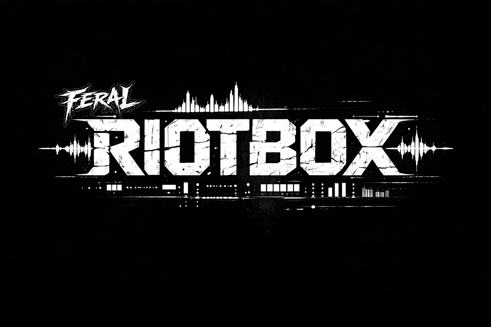

<p align="center">
  
</p>

# Riotbox

**Riotbox is a terminal-first live audio instrument for turning one source track into a controllable jam object.**

It is not a DAW, not a black-box generator, and not a nostalgia simulator. Riotbox is building toward a feral performance workflow where one source file becomes something you can **queue, mutate, capture, resample, recall, and steer in time** from the keyboard.

Right now Riotbox is already a serious prototype:

- load one WAV and analyze it into a playable session
- drive quantized actions on musical boundaries instead of firing edits blindly
- work through device-flavored lanes inspired by **TR-909**, **MC-202**, and **W-30**
- capture and reuse material without losing lineage
- save and restore deterministic sessions

## Start Here

If you only want the fastest possible first run:

1. load one WAV
2. press `Space`
3. press `f` for a TR-909 fill or `c` for a capture
4. switch to `Log` with `2`
5. confirm what Riotbox queued, when it committed, and what changed

That is the current core loop: **load material, queue one gesture, let it land in time, keep the good accident**.

If that first loop works, do not keep repeating only it. Move straight to:

- [`docs/jam_recipes.md`](docs/jam_recipes.md) `Recipe 2` to compare different first gestures
- [`docs/jam_recipes.md`](docs/jam_recipes.md) `Recipe 5` to compare different example sources

## What To Expect Right Now

If you start Riotbox on the same example loop and only press `Space`, `f`, `c`, and `2`, you will often get a **similar result each run**.

That is expected in the current prototype because:

- the first-run recipe is intentionally a **tiny learning path**, not a full performance recipe
- `f` always queues the same first TR-909 fill gesture
- the current build is still more about **quantized action flow** than about a wide expressive mixer/performance surface
- Riotbox is deterministic enough that the same source plus the same first gesture often produces the same first feel

So the quickstart is useful for confirming:

- transport is running
- actions queue and land on musical boundaries
- `Log` shows what actually committed
- capture is working

But it is **not** enough on its own to understand the whole shell.

## What Riotbox Is

Think of Riotbox as a hybrid of:

- a **live mutation instrument**
- a **sampler / capture machine**
- a **quantized performance sequencer**

The current shell is built for one job: make an analyzed loop or track feel like a playable performance object instead of a static file.

## What You Can Do Today

Today’s build already lets you:

- load a source WAV and open a working `Jam` session
- inspect `Jam`, `Log`, `Source`, and `Capture` screens
- queue actions that commit on **next beat**, **next bar**, or **next phrase**
- drive early lane behavior for:
  - **TR-909**: fill, reinforce, slam, takeover, release, scene-lock
  - **MC-202**: role, follower, answer
  - **W-30**: trigger, live recall, audition, bank swap, browse, damage, freeze, resample
- capture, promote, pin, and reuse material in the W-30 flow
- see pending, committed, rejected, and undone actions clearly

The honest status: **this is already playable as a prototype shell, but it is not yet a finished musician product.**

## Start In 5 Steps

1. Run Riotbox on your own WAV or one of the local test examples described in [`data/test_audio/README.md`](data/test_audio/README.md):

   ```bash
   cargo run -p riotbox-app --bin riotbox-app -- --source "data/test_audio/examples/Beat08_128BPM(Full).wav"
   ```

2. Press `Space` to start transport.

3. Switch between the four screens:
   - `1` `Jam`
   - `2` `Log`
   - `3` `Source`
   - `4` `Capture`

4. Try a few high-value gestures:
   - `y` scene select
   - `g` MC-202 follower
   - `f` TR-909 fill
   - `c` capture
   - `w` W-30 trigger
   - `u` undo

5. Watch the shell show what is **queued**, what gets **committed**, and what changed in each lane.

If you want the simplest first success, do not try every action. Start with:

- `Space` to make time move
- `f` to queue a TR-909 fill
- `c` to capture a phrase
- `2` to confirm the action committed in `Log`

If that works, stop repeating only that recipe. Move on to one of the more specific flows below.

## Learn By Doing

If you want more than the tiny quickstart loop, use the dedicated recipe guide:

- [`docs/jam_recipes.md`](docs/jam_recipes.md)

That guide contains concrete flows for:

- timing and commit learning
- comparing different first gestures
- capture and reuse
- undo
- source comparison
- reading `Jam` and `Log` together

It is the best place to continue once `Space -> f -> c -> 2` feels too repetitive.

Best next moves from there:

- `Recipe 2` if you want different lane behavior from the same source
- `Recipe 5` if you want to learn how `Beat03`, `Beat08`, `DH_BeatC`, and `DH_RushArp` change the shell feel
- `Recipe 8` if you want the first Scene Brain `scene jump -> restore` flow and the new `not ready -> ready` restore contrast
- `Recipe 9` if you want to compare which example source currently makes Scene Brain easiest to read
- `Recipe 10` if you want to explicitly practice reading the current Scene Brain `boundary -> pulse -> live/restore -> trail` cues
- `Recipe 7` only if you want one longer workflow loop for queue -> commit -> capture -> promote -> hit -> undo

If `just` is installed, the normal local check path is:

```bash
just ci
```

If `just` is not installed, the direct equivalents are:

```bash
cargo fmt --all
cargo test
cargo clippy --all-targets --all-features -- -D warnings
```

## First 30 Seconds

If you only want one tiny mental model:

- `Jam` tells you what is happening **now** and what is happening **next**
- `Log` tells you what really committed
- `Source` tells you what Riotbox thinks the material is
- `Capture` tells you what material you now own and can reuse

This is the current loop:

1. load audio
2. start transport
3. queue one obvious action
4. commit them on musical boundaries
5. capture the good accident

What should be clear after that first minute:

- Riotbox is showing both **now** and **next**
- actions do not always fire instantly; they commit on musical boundaries
- `Log` is the quickest place to see whether your action actually landed
- `Capture` is where good results start turning into reusable material

## How To Read The Screens

If you feel lost, do not stare at everything equally.

- `Jam`: what is happening now, what lands next, and which few gestures are worth trying
- `Log`: the truth surface; check this when you are unsure whether something really committed
- `Source`: what Riotbox thinks the file contains structurally
- `Capture`: what material you now own and can promote, pin, recall, or reuse

Practical rule:

- confused about whether something worked -> press `2`
- confused about what Riotbox thinks the source is -> press `3`
- confused about what you captured or promoted -> press `4`

## Example Session Flow

```text
load one loop
-> Riotbox analyzes tempo, sections, and candidates
-> you start transport
-> queue fill / follower / scene select / capture
-> actions land on the next beat, bar, or phrase
-> captures become reusable W-30 material
```

## Why Terminal At All?

Because Riotbox is trying to optimize for **speed, legibility, and musical intent**, not glossy panels.

The terminal is useful here because it makes a few important things unusually clear:

- what is happening now
- what is about to happen
- what just committed
- which action is still only pending

That matters for Riotbox because the product is built around **quantized change**, not just immediate parameter twiddling.

## Why It Is Different

Riotbox is aiming at a different center of gravity than adjacent tools.

- Compared with a DAW: Riotbox is narrower, faster, and more performance-first.
- Compared with live-coding systems: Riotbox is more device- and lane-shaped, with capture and replay safety built into the interaction spine.
- Compared with tracker / groovebox ideas: Riotbox leans harder into **source-derived mutation**, **capture lineage**, and **quantized action commitment**.

The current product promise is simple:

> load one track, break it into a live object, and keep musical control while Riotbox helps you mutate and reuse it.

## Current Screens

- `Jam`: the live surface
- `Log`: action trust and history
- `Source`: analysis-derived structure and confidence
- `Capture`: promotion, routing, and W-30 material flow

## Important Keys

The shell already has a broad action vocabulary, but these are the best first keys:

- `Space` play / pause
- `?` help
- `y` scene select
- `g` MC-202 follower
- `a` MC-202 answer
- `f` TR-909 fill
- `t` TR-909 takeover
- `c` capture
- `w` W-30 trigger
- `l` W-30 live recall
- `u` undo

The rest of the keymap is real, but it is not the best way to learn Riotbox on minute one.

## Current Limitations

To avoid the wrong expectation:

- Riotbox does **not** yet behave like a finished “load loop, hear a polished remix instantly” instrument
- some first gestures can sound repetitive if you use the same source and the same opening move every time
- the current shell is strongest as:
  - a quantized action/commit instrument
  - a capture-and-reuse prototype
  - a way to learn the lane behaviors
- it is still weaker as:
  - a polished mixer/performance surface
  - a broad preset/browse workflow
  - a fully obvious first-run musician product

So if the first recipe feels too similar every run, that does **not** mean nothing is working. It usually means you have learned the first minimal loop and should now try a different lane, a different source, or the capture/reuse path.

## Repo Map

- [`docs/`](docs/) — specs, decision log, workflow, and review artifacts
- [`plan/`](plan/) — master planning and the feral rebuild context
- [`crates/riotbox-app`](crates/riotbox-app/) — shell, app orchestration, runtime-facing state
- [`crates/riotbox-core`](crates/riotbox-core/) — core models, queue, transport, session, action lexicon
- [`crates/riotbox-audio`](crates/riotbox-audio/) — callback-side audio/runtime seams
- [`data/test_audio`](data/test_audio/) — source links and local-test audio notes

## Product Status

Riotbox is currently in the transition from prototype shell to fuller instrument.

What is already real:

- source ingest and analysis baseline
- deterministic sessions
- quantized action queue / commit model
- early Scene Brain seams
- early TR-909 / MC-202 / W-30 lanes
- capture and replay-safe regression coverage across those seams

What is still not done:

- polished musician-facing UI
- full source playback and mixer ergonomics
- deeper scene behavior
- stage-ready packaging

## Learn More

- [`docs/prd_v1.md`](docs/prd_v1.md)
- [`docs/execution_roadmap.md`](docs/execution_roadmap.md)
- [`docs/jam_recipes.md`](docs/jam_recipes.md)
- [`docs/specs/tui_screen_spec.md`](docs/specs/tui_screen_spec.md)
- [`docs/specs/action_lexicon_spec.md`](docs/specs/action_lexicon_spec.md)
- [`plan/riotbox_masterplan.md`](plan/riotbox_masterplan.md)
