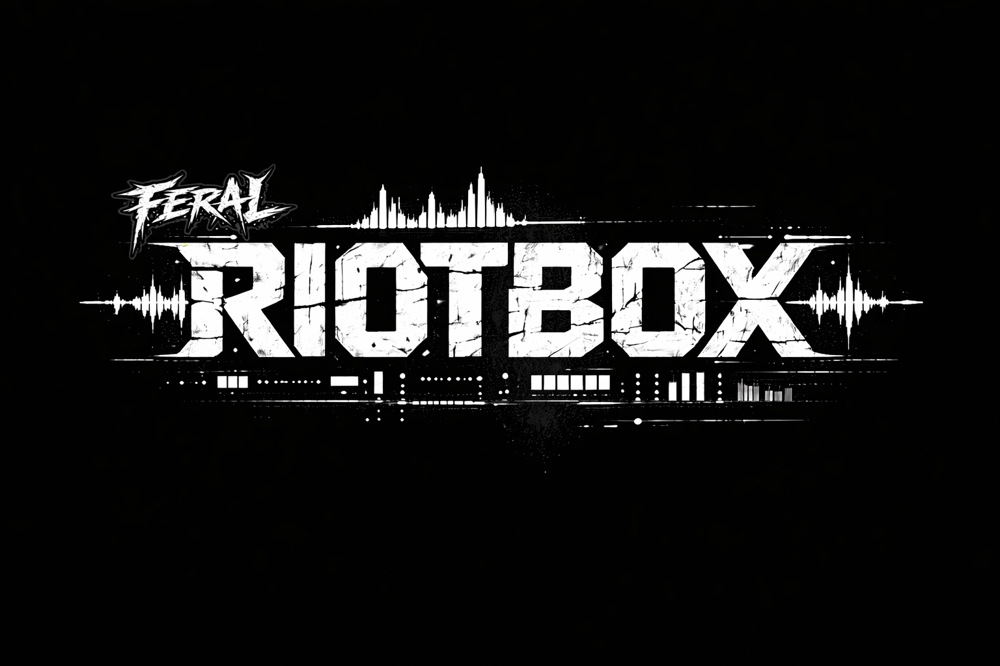

<p align="center">
  
</p>

# Riotbox

## Product Vision

> **Riotbox turns one source recording into a source-aware, playable live
> instrument: it listens, makes musical decisions, transforms material, and
> responds immediately to the performer.**

Think of Riotbox as a sampler, drum machine, performance sequencer, and
responsive bandmate combined in one terminal-first instrument. It analyzes the
source's rhythm, transients, density, and structure; captures distinctive
material; and lets the musician queue, trigger, mute, choke, retrigger,
reverse, filter, resample, recall, and reshape it on musical boundaries.

The goal is original, aggressive sample-based rave-punk and breakbeat with hard
hooks, physical drums, bass pressure, abrupt contrast, and gestures that matter
on stage. Riotbox is not a DAW, a black-box music generator, or a nostalgia
simulator. It must never disguise fixed templates or synthetic fallback as
source intelligence: the source evidence must change the musical decision, and
that decision must produce an audible, playable consequence.

Right now Riotbox is already a serious prototype:

- load one WAV and analyze it into a playable session
- drive quantized actions on musical boundaries instead of firing edits blindly
- work through device-flavored lanes inspired by **TR-909**, **MC-202**, and **W-30**
- capture and reuse material without losing lineage
- save and restore deterministic sessions

## Start Here

If you only want the fastest first playable run:

1. load one WAV, leave the monitor on `Source`, and check the readiness / route
   cue on `Jam`
2. press `Space` and confirm that you can hear the source
3. press `c`, wait for the capture to land, press `o` and hear the audition,
   then press `p` to promote it
4. when the source route is ready, press `M` once to move from `Source` to
   `Blend`
5. try `w`, `f`, `s`, and `y` one at a time; after the scene jump lands, press
   `Y` to restore the previous scene

What those steps mean:

1. **Load one WAV** so Riotbox can build a Source Graph, timing hints, and a
   Session around one piece of material. `Jam` should identify the current
   monitor and route. If it says that source audio is unavailable, treat that as
   a real degraded state: do not pretend that switching to `Blend` will repair
   it, and do not judge the performance gestures yet.
2. **Press `Space` once** to start transport and listen to the source-only
   anchor without Riotbox lanes. It still follows Riotbox monitor gain and the
   master limiter, so it is not a bit-identical untreated player. Leave
   transport running. Quantized actions will first appear as pending and
   then commit on their beat, bar, or phrase boundary; `Jam` keeps that handoff
   visible without requiring a trip to `Log`.
3. **Build one reusable hit.** `c` queues a source-window capture. Wait until it
   commits, use `o` and wait to hear the raw captured moment, then use `p` to
   promote it to the focused W-30 pad. An unavailable preview is silence plus
   an honest cue, never synthetic replacement music.
4. **Press `M` once only after source playback is ready.** Monitor mode cycles
   `Source -> Blend -> Riotbox`; `Blend` keeps the source as an audible anchor
   while Riotbox gestures enter around it. This is the safest place to judge a
   first performance.
5. **Make the room change.** `w` hits the promoted W-30 pad, `f` adds a TR-909
   fill, `s` commits the harder TR-909 slam, and `y` jumps scene. Let each move
   land before judging it. After `y` has committed, `Y` restores the previous
   scene. Use `Log` only when you want the full forensic action history.

That is the current core loop: **hear the source, capture a keeper, blend Riotbox
in, perform obvious contrasts, and restore the scene**.

### Feral Break Alpha

For the one curated P023 starting state, use the same capture path but press
`F` after promotion instead of reconstructing lane gains and macros by hand.
`F` activates the versioned `Feral Break Alpha v2` preset, selects `Blend`, and
shows the active `feral_rebuild` profile and preset in the Jam header.

With the trusted dense-break source, the supported eight-bar practice arc is:

1. `w` establishes the source-backed W-30 hook for two bars
2. `s` raises TR-909 drum/transient pressure for two bars
3. `f` makes the destructive one-bar break cut
4. `y` swaps to the contrast scene for one bar
5. `Y`, then `D`, returns to the first scene with a damaged W-30 payoff for two bars

The first satisfying moment should be the recognizable W-30 rhythmic hook
inside the first two bars, not merely a louder mix. The current reference
source assigns bass ownership from source evidence; `unassigned` is valid and
means the example is judged for hook, drums, contrast, and return rather than
for missing bass pressure. See
[`Recipe 17`](docs/jam_recipes.md#recipe-17-play-feral-break-alpha) for capture,
audition, save/restart, recall, and the exact local proof command.

If that first loop works, continue with:

- [`docs/jam_recipes.md`](docs/jam_recipes.md) for the same Golden Path with
  expected screen and listening cues
- [`docs/jam_recipes.md`](docs/jam_recipes.md) `Recipe 14` for its CI-safe
  control-plus-exact-mixer proof
- [`docs/jam_recipes.md`](docs/jam_recipes.md) `Recipe 17` for the curated
  Feral Break Alpha eight-bar path
- [`docs/jam_recipes.md`](docs/jam_recipes.md) `Recipe 5` to compare different example sources
- [`docs/benchmarks/lane_recipe_listening_pack_2026-04-26.md`](docs/benchmarks/lane_recipe_listening_pack_2026-04-26.md) if you want offline WAV proof for the current TR-909 and MC-202 recipe contrasts

## What To Expect Right Now

The first-playable path now exposes more than the old `Space -> f/c -> Log`
smoke, but it is still a bounded prototype workflow rather than an instant
finished remix.

That is expected in the current prototype because:

- the Golden Path deliberately uses one capture and a small set of
  room-changing gestures before exposing the wider keymap
- a repeated `f` on the same source still exercises the same fill intent
- gesture contrast and exact live-mixer reachability are ahead of broad musical
  variety and polished automatic arrangement
- Riotbox is deterministic enough that the same source plus the same first gesture often produces the same first feel

MC-202 gestures are no longer only log/state cues: after a committed `g` follower, `a` answer, `P` pressure, or `I` instigator, the current runtime can mix a bounded bass voice through the music bus. This is still a first audio seam, not a finished MC-202 synth engine or MIDI-controlled bassline editor.

So the quickstart is useful for confirming:

- the original source is actually audible before Riotbox is blended in
- actions queue and land on musical boundaries
- pending and committed state stays readable on `Jam`
- capture, audition, promotion, and the W-30 hit form one audible handoff
- `w`, `f`, `s`, `y`, and `Y` expose distinct performance intentions

But it is **not** enough on its own to understand the whole shell.

For W-30 capture reuse, the current source-backed path is intentionally bounded:
Riotbox can preview short source-window excerpts and marks them with `.../src`.
`.../unavailable` is a degraded state and produces no replacement music. Use
[`Recipe 11`](docs/jam_recipes.md#recipe-11-check-source-backed-w-30-reuse) for
the current TUI smoke test and
[`Recipe 13`](docs/jam_recipes.md#recipe-13-prove-w-30-source-backed-audio-beats-the-diagnostic-control)
for an offline comparison against an explicitly non-product diagnostic control.
This is not yet a full W-30 sampler engine.

## What Riotbox Is

Think of Riotbox as a hybrid of:

- a **live mutation instrument**
- a **sampler / capture machine**
- a **quantized performance sequencer**

The current shell is built for one job: make an analyzed loop or track feel like a playable performance object instead of a static file.

## Effect Language And Intended Use

Riotbox is growing toward a compact performance vocabulary rather than a long
list of interchangeable effects. Each gesture should have an obvious musical
role, land on a trusted beat, bar, or phrase boundary, and preserve recognizable
source character unless the performer deliberately asks for destruction.

| Effect family | What it does | When to use it |
| --- | --- | --- |
| **Hook Turnaround** | Reverses part of a recognizable hook and returns cleanly to the loop | At the end of a phrase to break repetition or announce a transition |
| **Choke / Silence Cut** | Removes the active material abruptly | Immediately before a drop or a hard return |
| **Reverse** | Pulls a hit or source fragment backward | To create suction into a transition or a surprising hook variation |
| **Retrigger / Stutter** | Repeats a short fragment rhythmically | To build tension, make fills, or introduce controlled chaos |
| **Pitch Dive** | Pulls pitch and energy downward | For a destructive exit, breakdown, or transition |
| **Filter Slam** | Narrows or opens the spectrum quickly | To create a strong contrast between a build and its return |
| **Damage / Bitcrush** | Makes source material rougher, grainier, and more aggressive | As a short punk accent or damaged payoff rather than a permanent wash |
| **Dropout And Restore** | Removes musical roles and brings them back in a changed state | For large arrangement contrasts and a stronger re-entry |
| **Pressure Lift** | Raises drum, bass, or hook pressure selectively | During a build, according to the kind of energy the source can support |
| **Source Chop / Loop Mutation** | Turns recognizable source material into a new hook or loop | To create playable riffs while retaining the identity of the recording |
| **Scene Or Role Swap** | Moves leadership between source, drums, bass, and the sample hook | For larger live transitions and clearly changed sections |

The intended workflow is consistent across these families:

1. Riotbox analyzes the source and identifies material that can support a
   musical intervention.
2. The performer chooses an intention such as a turnaround, dropout, or
   pressure lift.
3. Riotbox schedules it on an appropriate musical boundary.
4. The gesture transforms the source audibly without hiding behind a generic
   replacement pattern.
5. The performance either returns cleanly or moves into a deliberate new
   scene.

The performer currently owns most gesture choices. Future source intelligence,
Ghost, and Feral behavior may recommend suitable gestures or execute them in an
explicit assist mode, but should not stack effects arbitrarily. The effect
families above describe the intended product language, not a promise that every
item is already complete or assigned to a delivery ticket. Hook Turnaround and
Pitch Dive are implemented performer-owned W-30 gestures with positive bounded
product reviews. Filter Slam has a provisional eight-beat Development keep but
is not yet a product action. Other families range from playable early behavior
to planned musical depth and broader source qualification.

## What You Can Do Today

Today’s build already lets you:

- load a source WAV and open a working `Jam` session
- move deliberately between `Source`, `Blend`, and `Riotbox` monitor modes
- inspect `Jam`, `Log`, `Source`, and `Capture` screens
- queue actions that commit on **next beat**, **next bar**, or **next phrase**
- drive early lane behavior for:
  - **TR-909**: fill, reinforce, slam, takeover, release, scene-lock
  - **MC-202**: role, follower, answer, pressure, instigator, phrase mutation, touch
  - **W-30**: trigger, live recall, audition, bank swap, browse, damage, Hook Turnaround, Pitch Dive, freeze, resample
- capture, promote, pin, and reuse material in the W-30 flow
- perform a scene jump and restore with `y` / `Y`
- see pending, committed, rejected, and undone actions clearly

The honest status: **this is already playable as a prototype shell, but it is not yet a finished musician product.**

## Start In 5 Steps

1. Run Riotbox on your own WAV or one of the local test examples described in [`data/test_audio/README.md`](data/test_audio/README.md):

   ```bash
   cargo run -p riotbox-app --bin riotbox-app -- --source "data/test_audio/examples/Beat08_128BPM(Full).wav"
   ```

2. On `Jam`, verify that the monitor is `Source`, press `Space`, and listen to
   the source. Stop here if the route is unavailable or the audio runtime is
   degraded.

3. Press `c`, wait for the capture commit, press `o`, and wait to hear the raw
   audition. Then press `p` to promote it. `Jam` shows the pending / committed
   handoff; `4` opens the fuller `Capture` view if you need it.

4. Press `M` once to select `Blend`, then try one gesture at a time:
   - `w` W-30 promoted-pad hit
   - `f` TR-909 fill
   - `s` TR-909 slam
   - `y` scene jump
   - `Y` restore after the jump lands

5. Watch and hear each gesture land. Use `2` for the detailed `Log`, `3` for
   `Source`, or `4` for `Capture` when a result is ambiguous.

Before judging timing-sensitive gestures, read the compact timing cue on `Jam` or `Source`.
For example, `timing needs confirm | low | kick+bb` means Riotbox found useful
kick/backbeat evidence but is not ready to trust the grid automatically yet. The
short cue meanings are documented in [`docs/jam_recipes.md`](docs/jam_recipes.md#read-the-timing-cues).

If you want the simplest first success, stay on the supported Golden Path:

- hear the source first
- let `c` land, audition with `o`, and promote with `p`
- select `Blend` with one press of `M`
- let `w`, `f`, `s`, and `y` land one at a time, then use `Y` to restore

The on-screen pending / committed state is enough for normal playing. Open
`Log` when a result is ambiguous or you need the complete action trace.

## Learn By Doing

If you want more than the bounded Golden Path, use the dedicated recipe guide:

- [`docs/jam_recipes.md`](docs/jam_recipes.md)

That guide contains concrete flows for:

- timing and commit learning
- comparing different first gestures
- capture and reuse
- undo
- source comparison
- reading `Jam` and `Log` together

It is the best place to continue once the first
`Source -> capture -> Blend -> perform -> restore` pass is clear.

Best next moves from there:

- `Recipe 2` if you want different lane behavior from the same source
- `Recipe 3` if you want the first capture -> raw audition -> promote -> W-30 hit path
- `Recipe 5` if you want to learn how `Beat03`, `Beat08`, `DH_BeatC`, and `DH_RushArp` change the shell feel
- `Recipe 8` if you want the first Scene Brain `scene jump -> restore` flow and the new `not ready -> ready` restore contrast
- `Recipe 9` if you want to compare which example source currently makes Scene Brain easiest to read
- `Recipe 10` if you want to explicitly practice reading the current Scene Brain `boundary -> pulse -> live/restore energy -> trail` cues
- `Recipe 11` if you want to check whether W-30 capture reuse is source-backed,
  artifact-backed, or honestly unavailable
- `Recipe 12` if you want to follow the new `feral ready` suggested gesture path
- `Recipe 13` if you want an offline W-30 source-vs-diagnostic-control proof
  before judging the TUI by ear
- `Recipe 14` if you want the first-playable observer action contract checked
  alongside the exact RuntimeMix dense-break pack
- `Recipe 15` if you want an offline Feral grid listening pack and need to choose `auto` versus explicit BPM honestly
- `Recipe 7` if you want a longer Golden Path practice run with monitor handoff,
  four performance gestures, and restore

If `just` is installed, the normal local check path is:

```bash
just ci
```

If you render local audio QA packs and want to capture a listening verdict, start a structured ignored note with:

```bash
just audio-qa-notes artifacts/audio_qa/local/notes.md
```

For the current Feral grid listening pack, do not assume `auto` BPM is always the best-sounding path yet. Auto mode is now honest and reports whether it used source timing or fell back to the static grid, but real example files can still need an explicit BPM:

```bash
just feral-grid-pack "data/test_audio/examples/Beat03_130BPM(Full).wav" local-beat03-explicit 130.0 8 1.0 0.0
just feral-grid-pack "data/test_audio/examples/Beat08_128BPM(Full).wav" local-beat08-auto auto 8 1.0 0.0
just feral-grid-pack "data/test_audio/examples/DH_BeatC_120-01.wav" local-dh-beatc-explicit 120.0 8 1.0 0.0
```

Then inspect `manifest.json`: `grid_bpm_source`, `source_timing_bpm_delta`, and `source_timing.bpm_agrees_with_grid` tell you whether the pack timing was trusted or only a fallback. The current local benchmark is documented in [`docs/benchmarks/source_timing_example_readiness_2026-05-07.md`](docs/benchmarks/source_timing_example_readiness_2026-05-07.md).

If `just` is not installed, the direct equivalents are:

```bash
cargo fmt --all
cargo test
cargo clippy --all-targets --all-features -- -D warnings
```

## First 30 Seconds

If you only want one tiny mental model:

- `Jam` tells you what is happening **now** and what is happening **next**
- `Log` tells you what really committed
- `Source` tells you what Riotbox thinks the material is
- `Capture` tells you what material you now own and can reuse

This is the current loop:

1. load audio and hear it in `Source` monitor mode
2. capture, audition, and promote one source-backed moment
3. switch once to `Blend`
4. perform `w`, `f`, `s`, and `y` on their musical boundaries
5. use `Y` to restore after the scene jump

What should be clear after that first minute:

- Riotbox is showing both **now** and **next**
- actions do not always fire instantly; they commit on musical boundaries
- `Jam` keeps the pending-to-committed handoff visible while you play
- `Log` remains the detailed history when you need to investigate a result
- `Capture` is where good results start turning into reusable material

## How To Read The Screens

If you feel lost, do not stare at everything equally.

- `Jam`: what is happening now, what lands next, and which few gestures are worth trying
- `Log`: the truth surface; check this when you are unsure whether something really committed
- `Source`: what Riotbox thinks the file contains structurally
- `Capture`: what material you now own and can promote, pin, recall, or reuse

Practical rule:

- confused about whether something worked -> press `2`
- confused about what Riotbox thinks the source is -> press `3`
- confused about what you captured or promoted -> press `4`
- debugging a confusing run -> add `--observer artifacts/audio_qa/local/user-session/events.ndjson` and inspect the NDJSON event trail
- debugging the Jam timing rail -> use `docs/jam_recipes.md` Recipe 1b to
  validate the observer `source_timing` snapshot

## Example Session Flow

```text
load one loop
-> Riotbox analyzes tempo, sections, and candidates
-> hear it with the Source monitor
-> capture, audition, and promote one reusable W-30 moment
-> switch to Blend
-> trigger the W-30 hit, fill, slam, and scene jump in time
-> restore the previous scene
```

## Why Terminal At All?

Because Riotbox is trying to optimize for **speed, legibility, and musical intent**, not glossy panels.

The terminal is useful here because it makes a few important things unusually clear:

- what is happening now
- what is about to happen
- what just committed
- which action is still only pending

That matters for Riotbox because the product is built around **quantized change**, not just immediate parameter twiddling.

## Why It Is Different

Riotbox is aiming at a different center of gravity than adjacent tools.

- Compared with a DAW: Riotbox is narrower, faster, and more performance-first.
- Compared with live-coding systems: Riotbox is more device- and lane-shaped, with capture and replay safety built into the interaction spine.
- Compared with tracker / groovebox ideas: Riotbox leans harder into **source-derived mutation**, **capture lineage**, and **quantized action commitment**.

The current product promise is simple:

> load one track, break it into a live object, and keep musical control while Riotbox helps you mutate and reuse it.

## Current Screens

- `Jam`: the live surface
- `Log`: action trust and history
- `Source`: analysis-derived structure and confidence
- `Capture`: promotion, routing, and W-30 material flow

## Important Keys

The shell already has a broad action vocabulary, but these are the best first keys:

- `Space` play / pause
- `?` help
- `M` cycle `Source` / `Blend` / `Riotbox` monitor mode
- `y` scene select / jump
- `Y` restore the previous landed scene
- `g` MC-202 follower
- `a` MC-202 answer
- `P` MC-202 pressure
- `I` MC-202 instigator
- `G` MC-202 phrase mutation
- `<` / `>` lower / raise MC-202 touch
- `f` TR-909 fill
- `s` TR-909 slam
- `t` TR-909 takeover
- `c` capture
- `w` W-30 trigger
- `l` W-30 live recall
- `u` undo

The rest of the keymap is real, but it is not the best way to learn Riotbox on minute one.

## Current Limitations

To avoid the wrong expectation:

- Riotbox does **not** yet behave like a finished “load loop, hear a polished remix instantly” instrument
- some first gestures can sound repetitive if you use the same source and the same opening move every time
- the current shell is strongest as:
  - a quantized action/commit instrument
  - a capture-and-reuse prototype
  - a bounded live Source / Blend / Riotbox performance flow
- it is still weaker as:
  - a polished, broadly expressive mixer/performance surface
  - a broad preset/browse workflow
  - an equally obvious first run across every source and degraded device state

So if the first recipe feels too similar every run, that does **not** mean
nothing is working. It usually means you have learned the bounded Golden Path
and should now try a different lane, source, or scene strategy.

## Repo Map

- [`docs/`](docs/) — specs, decision log, workflow, and review artifacts
- [`plan/`](plan/) — master planning and the feral rebuild context
- [`crates/riotbox-app`](crates/riotbox-app/) — shell, app orchestration, runtime-facing state
- [`crates/riotbox-core`](crates/riotbox-core/) — core models, queue, transport, session, action lexicon
- [`crates/riotbox-audio`](crates/riotbox-audio/) — callback-side audio/runtime seams
- [`data/test_audio`](data/test_audio/) — source links and local-test audio notes

## Product Status

Riotbox is currently in the transition from prototype shell to fuller instrument.

What is already real:

- source ingest and analysis baseline
- deterministic sessions
- quantized action queue / commit model
- early Scene Brain seams
- early TR-909 / MC-202 / W-30 lanes
- capture and replay-safe regression coverage across those seams

What is still not done:

- polished musician-facing UI
- full source playback and mixer ergonomics
- deeper scene behavior
- stage-ready packaging

## Learn More

- [`docs/prd_v1.md`](docs/prd_v1.md)
- [`docs/execution_roadmap.md`](docs/execution_roadmap.md)
- [`docs/jam_recipes.md`](docs/jam_recipes.md)
- [`docs/specs/tui_screen_spec.md`](docs/specs/tui_screen_spec.md)
- [`docs/specs/action_lexicon_spec.md`](docs/specs/action_lexicon_spec.md)
- [`plan/riotbox_masterplan.md`](plan/riotbox_masterplan.md)

## License

Feral Riotbox is source-available, not open source. You may inspect, build, and
run it locally for personal evaluation under the terms in [`LICENSE`](LICENSE).

Publishing forks, distributing modified versions, commercial use, and use of the
Feral Riotbox name or logo require prior written permission.
