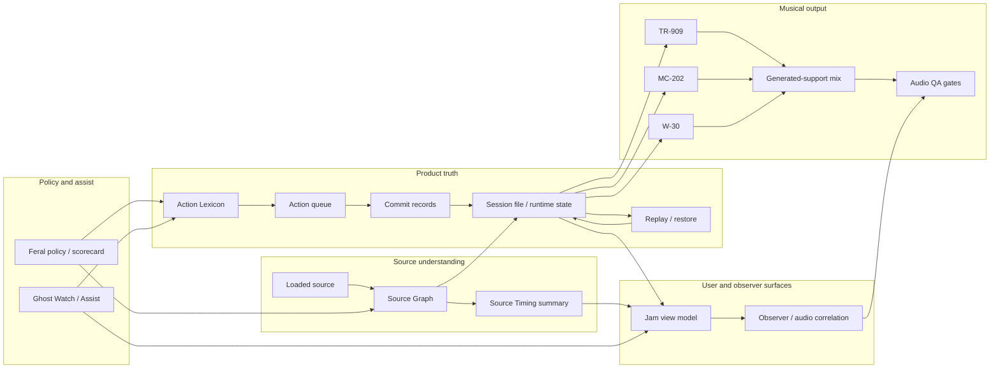
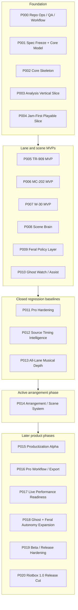
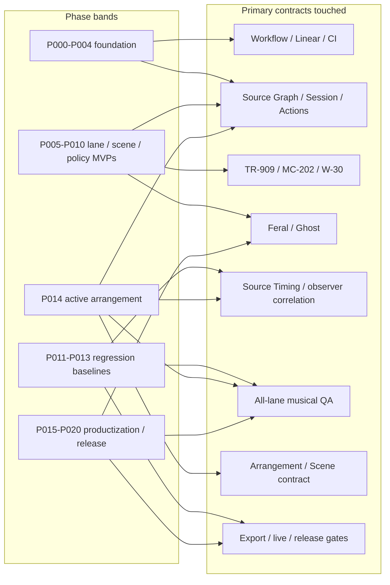

# Architecture And Phase Map

Status: active orientation diagram

Linear mirror:
<https://linear.app/riotbox/document/riotbox-architecture-and-phase-map-86de17a4248a>

This document connects the functional Riotbox spine to the Linear phase
boundaries. It is an orientation map, not a replacement for specs, Linear, or
the roadmap.

## Functional Spine

P014 sits on the existing Source Graph, Source Timing, Session, Action Lexicon,
queue / commit, replay, Jam view, and audio QA contracts. It must not introduce
a second arrangement truth. P012 and P013 remain regression baselines while P014
adds arrangement / scene behavior.

## Phase Boundaries

## Phase To Contract Map

