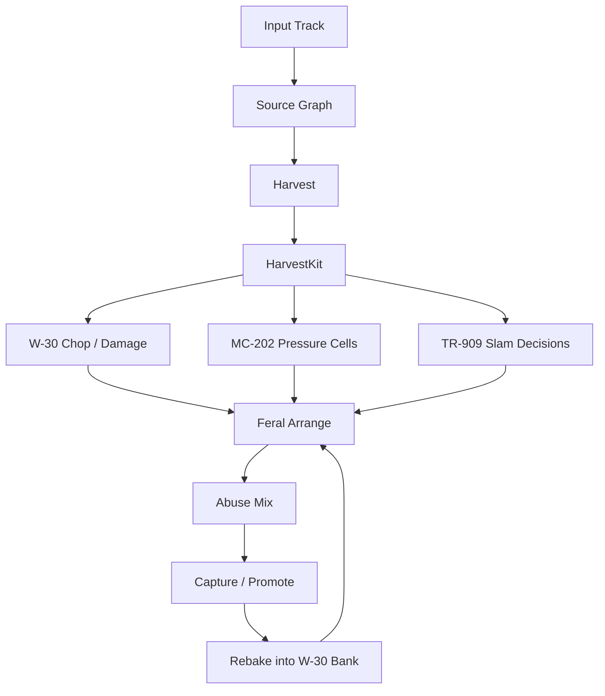
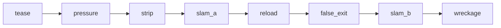
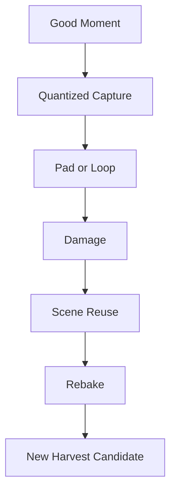
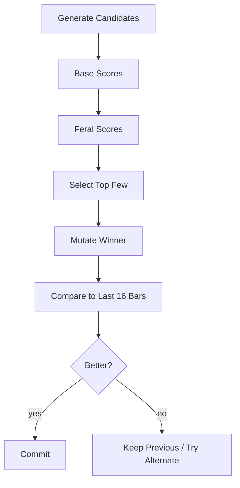

# Riotbox - Supplemental Plan: Liam / Feral Rebuild Profile

**Version:** 0.1  
**Status:** addendum to the existing masterplan  
**Reference:** extends `plan/riotbox_masterplan.md`, does not replace it  
**Purpose:** specifies a particular creative workflow for aggressive reconstruction of source audio within the Riotbox system

---

## 1. Why This Document Exists

The existing masterplan already defines architecture, device personalities, session model, Ghost system, capture, resampling, MVP, and phases. This document does **not** introduce a second overall architecture. Instead, it describes an **additional profile** that we can internally treat as the **Liam / Feral Rebuild Profile**.

This profile operationalizes a very specific way of working:

- do not treat material as a sacred source, but as a **raw-material store**
- do not let the whole loop run on respectfully, but **harvest useful fragments**
- build new breaks, hook shards, pressure phrases, and scenes out of those fragments
- immediately freeze, sample, bend, and reuse strong moments
- make the result feel more like a **hostile reconstruction** than a normal remix

### What this document deliberately does **not** do

- no new core architecture
- no alternative session format
- no second Ghost system
- no new device family beyond MC-202, W-30, and TR-909
- no separate export or UI stack

### What this document adds

- a precise behavioral profile for a specific rebuild mode
- additional heuristics for selection, destruction, variation, and resampling
- new scores, objects, Ghost tools, and backlog deltas
- merge rules so work is not duplicated relative to the masterplan

---

## 2. Attachment Points in the Existing Masterplan

This addendum attaches to existing areas instead of overwriting them.

| Masterplan | Stays in the masterplan | This addendum adds |
|---|---|---|
| 11 Analysis Pipeline | decode, stems, grid, harmony, sections, slice / loop mining | **harvest logic**, feral tags, additional inclusion and exclusion rules |
| 13.1 MC-202 | mono lane, follower / instigator, `202_touch` | **pressure cells**, anti-overplay rules, answer phrases |
| 13.2 W-30 | slice pool, pad forge, loop freezer, resample lab | **damage profiles**, rebake workflow, hook shards, HarvestKit |
| 13.3 TR-909 | reinforcement, accent, fill brain, slam bus | **underkick**, backbeat protection, strip / slam preparation |
| 14 Arrangement | section grammar, phrase generation, micro variation | **feral scene templates**, max-copy guard, escalation curves |
| 15 Scoring | groove, identity, impact, novelty, restraint | **feralness**, broken-hook score, slam headroom, bar variance |
| 23/24 Capture & Resample | capture-first, self-sampling, promotion into scenes | **harvest -> rebake -> reuse** as an explicit loop |
| 31-33 MVP / phases / backlog | product phases and module backlog | **delta tasks** for this profile |

### Integration rule

The masterplan remains the **source of truth for system structure**. This document is the **source of truth for the feral rebuild profile**.

---

## 3. Creative Thesis of the Profile

This profile should build **neither a Prodigy clone** nor a "style transfer" system. It should define a mode in which Riotbox:

1. pulls out the **most useful points of conflict** from an input track,
2. makes those points rhythmically, tonally, and spectrally **weapon-ready**,
3. builds several aggressive rebuild candidates from them,
4. makes the best of those candidates playable live,
5. and immediately feeds strong intermediate results back into the system.

The target state of a run is not "finished song at the press of a button," but rather:

- a **HarvestKit** of reusable events
- several **break variants**
- one or more **broken hook shards**
- a strong **MC-202 pressure cell**
- two to six **useful escalation candidates**
- at least one moment you want to capture and reuse immediately

### Success means here

- more pressure than the original
- more rhythmic dominance than the original
- less polite continuity, more intentional intervention
- still some recognition in DNA, texture, or gesture
- never simply "the same song made dirtier"

---

## 4. Profile Name, Operating Style, and Main Controls

Working name in code and presets:

```text
profile = feral_rebuild
subprofile = liam_workflow
```

This profile should **not** be a new top-level mode, but a **style / policy layer** on top of the existing engines and pipelines.

### Recommended core controls

Existing macros from the masterplan remain valid. This profile only interprets them more sharply.

```text
source_retain   0.0 .. 1.0   // how much real source material remains audible
202_touch       0.0 .. 1.0   // how strongly the mono lane takes over identity
w30_grit        0.0 .. 1.0   // bit / rate / sampler dirt
909_slam        0.0 .. 1.0   // punch, accent, fill, and drop pressure
mutation        0.0 .. 1.0   // appetite for mutation in general
```

Additional profile parameters:

```text
violence        0.0 .. 1.0   // how radically material is rebuilt
bar_variance    0.0 .. 1.0   // how strongly bar-by-bar differences are enforced
hook_damage     0.0 .. 1.0   // how mutilated and aggressive hook shards are processed
tail_cut        0.0 .. 1.0   // how hard slice tails are cut
underkick       0.0 .. 1.0   // strength of the 909 underkick beneath breaks
rebake_bias     0.0 .. 1.0   // how quickly internal results are pushed back into W-30 banks
```

### Important product rule

These additional parameters do **not** all need to be visible on the Jam screen. For v1 they may be derived internally from existing macros. Example:

```text
violence    = f(mutation, w30_grit, 909_slam)
bar_variance= f(mutation, energy)
hook_damage = f(w30_grit, mutation)
```

That avoids UI bloat.

---

## 5. Expected Behavior After an MP3 Run

When a user loads a track and activates the feral profile, Riotbox should **not** simply generate a different arrangement of the same material.

I would instead expect the following results:

### 5.1 A HarvestKit

The whole song does not matter. What matters is 20-80 usable atoms:

- kick fragments
- snares
- ghost notes
- hats
- stabs
- vocal barks
- short harmonic islands
- noise / wash elements
- small transients with character

### 5.2 Several break variants

At least three variants for every useful core:

- `break_A` = relatively close to the source groove
- `break_B` = clearly chopped up, but still readable
- `break_C` = aggressively rebuilt, with 909 support

### 5.3 A broken hook

Not a complete melody, but rather:

- the remainder of a word
- half a chord
- a short synth bite
- a newly resampled internal sound
- a microtonally bent fragment call

### 5.4 A pressure lane

The MC-202 side should not plaster over everything, but should:

- provide bass weight
- answer the hooks
- gain tension during builds
- take over identity in the drop when needed

### 5.5 Several mix candidates

Not just one clean export, but for example:

```text
cleaner_dirty_mix.wav
more_feral_mix.wav
wrecked_bus_print.wav
```

This profile lives from testing not only patterns, but also **levels of aggression**.

---

## 6. Feral Pipeline

The existing analysis and device architecture remains in place. This profile overlays it with a **specific production logic**.



### 6.1 Stage 1 - Harvest

This stage does not only analyze. It **actively searches for reusable violence**.

#### Goal

Build a short, playable, reusable **HarvestKit** from the Source Graph.

#### Candidate types

```text
kick
snare
ghost
hat
fill
wash
stab
chord_shard
vocal_bark
noise_hit
riser_fragment
```

#### Additional harvest scores

Each candidate receives additional profile values on top of the existing quality scores:

```text
transient_strength
backbeat_anchor_value
tail_cleanliness
aliasing_potential
slogan_potential
slam_headroom
reuse_flexibility
feral_uniqueness
```

#### Selection rules

- prefer material with **clear attack**
- prefer material that becomes **more interesting** under pitch or rate shift
- prefer quiet ghost events if amplification reveals character
- prefer harmonic shards with short, sharp identity
- avoid long, dense material that turns to mush when cut apart

#### Exclusion rules

- surfaces that are too wide and too full, without clean transients
- long remnants with too much bleed
- loops that are too complex to work except as a whole
- material that is only intelligible in the full mix

### 6.2 Stage 2 - W-30 Chop / Damage

This stage implements the sampler logic. It is not just slice editing, but **controlled mistreatment**.

#### Core rules

- **tail cut over beauty**: better dry and choppy than gracefully decaying
- **rate shift over time stretch**: pitch and time may bend together
- **pitch as a weapon**: individual slices may be pitched extremely high or low
- **ghost promotion**: tiny off-hits may become the main attraction
- **reverse sparingly, but precisely**: only as call, pickup, or drop preparation

#### Damage profiles

Each W-30 pad candidate may carry a damage profile:

```text
DamageProfile {
  tail_cut,
  grit,
  rate_shift,
  reverse_prob,
  drive,
  mono_narrow,
  room_send,
  transient_boost,
  pitch_bias
}
```

#### Important heuristics

- a slice may be brutally short if its attack remains strong
- snares may become brighter and uglier than in the original
- ghost notes may be over-amplified if they improve the roll
- a break may never run longer than 2 bars "as is" without intervention

### 6.3 Stage 3 - MC-202 Pressure Cells

The 202 lane remains anchored in the masterplan. This profile only sharpens its rules.

#### Design principles

- few notes instead of many notes
- 1- or 2-bar cells instead of endless phrases
- slides only at transitions with real function
- accents where form or friction is created
- not "intelligent," but **striking**

#### Roles

```text
FOLLOWER   = supports source / harmony, builds low-end pressure
ANSWER     = reacts to hook or drum patterns
INSTIGATOR = pulls the scene in a new direction
```

#### Prohibitions

- no dense continuous melody
- no virtuosic ornamentation
- no harmonic over-explanation of every chord
- no bassline chatter without dramaturgical purpose

### 6.4 Stage 4 - TR-909 Slam Decisions

The 909 role here is not only reinforcement, but a **decision machine for impact**.

#### Main tasks

- provide missing low-end force beneath breaks
- keep the backbeat readable, even when the break is heavily destroyed
- mark drop preparation
- selectively densify hats and claps

#### New additional logic

**Underkick**:

- detects whether the existing break carries enough low-end pressure
- places a 909 kick underneath when the break does not physically push enough
- varies decay and loudness depending on the scene

**Backbeat Guard**:

- if the snare on 2 and 4 becomes unclear through disassembly, either
  - a snare layer,
  - a clap,
  - or an accent solution must restore the form

**Pre-Drop Strip**:

- before drops, the system may deliberately remove individual layers
- the return must feel clearly more violent than what came before

### 6.5 Stage 5 - Feral Arrange

The existing arranger is not replaced. This profile adds **scene templates** and harsher movement rules.



#### Recommended scene family

```text
tease
pressure
strip
slam_a
reload
false_exit
slam_b
wreckage
```

#### Rules

- never more than **4 bars without audible variation**
- every drop needs at least **one subtraction** beforehand
- at most **one hard destruction** per phrase without reorientation
- at least **one new feature** every 16 bars
- at least **one capture-worthy moment** every 32 bars

#### Variation types

- slice swap
- snare replacement
- half-bar silence
- 202 answer
- hook shard as pickup
- reverse call
- hat density wave
- brief total teardown with immediate restore

### 6.6 Stage 6 - Abuse Mix

This stage lives within the existing mixer / FX concept, but gets a clear behavioral target here.

#### Goal

Not high-end hi-fi, but **controlled brutality**.

#### Preferred tools

- parallel distortion
- room send for drum push
- filter rides with coarse jumps instead of smooth curves
- bus compression with clearly audible grip
- bit and rate reduction on selected elements
- mono narrowing for hooks and aggressive mid focus

#### Rule

The mix may feel rough, but it must not collapse randomly.

### 6.7 Stage 7 - Capture / Promote / Rebake

This is where the real instrument character of the profile lives.

#### Core idea

Do not sample only from the source, but **feed your own intermediate results back into the sampler**.



#### Rebake rules

- a strong 202 phrase may be bounced to a W-30 pad
- an aggressive drum bus may become new one-shot material
- a hook shard may become more unintelligible but more striking through another resampling pass
- every rebaked object must retain its origin in the provenance system

---

## 7. Data Model Extensions

The existing session / analysis / action model remains in place. Only additional objects are introduced.

### 7.1 HarvestAtom

```text
HarvestAtom {
  id,
  source_span,
  stem,
  family,
  onset_confidence,
  transient_strength,
  tail_cleanliness,
  aliasing_potential,
  slogan_potential,
  slam_headroom,
  feral_uniqueness,
  tags[]
}
```

### 7.2 HarvestKit

```text
HarvestKit {
  track_id,
  bpm,
  key_hint,
  atoms[],
  loop_candidates[],
  hook_shards[],
  break_anchors[],
  notes
}
```

### 7.3 BreakVariant

```text
BreakVariant {
  id,
  source_atoms[],
  anchor_density,
  909_underkick,
  damage_profile,
  bar_variance,
  human_readable_label
}
```

### 7.4 HookShard

```text
HookShard {
  id,
  origin,
  source_atom_ids[],
  slogan_score,
  pitch_hint,
  mono_bias,
  damage_profile,
  replay_roles[]
}
```

### 7.5 FeralSceneIntent

```text
FeralSceneIntent {
  scene_type,
  energy_target,
  destruction_budget,
  rebuild_budget,
  source_retain,
  capture_priority,
  preferred_actions[]
}
```

### 7.6 Data integration rule

- **Source Graph remains the unchanged central truth**
- **HarvestKit** is a derived working set
- the **Pad Object** from the masterplan remains the W-30 target form
- the **Action Log** records every escalation and every rebake

---

## 8. Additional Scores

The existing scores are fundamentally sufficient, but this profile needs additional criteria.

### 8.1 Feralness Score

Measures whether a candidate has enough friction, aggression, and rebuild potential.

### 8.2 Broken Hook Score

Measures whether a hook shard remains memorable even after damage.

### 8.3 Slam Headroom Score

Measures whether a break or stem still has room for 909 pressure, drive, and room.

### 8.4 Bar Variance Score

Measures whether enough audible change happened in the recent bars.

### 8.5 Weapon Simplicity Score

Rewards simple, cutting, memorable motives over over-clever detail.

### 8.6 Candidate selection



---

## 9. Ghost and Agent Integration

The Ghost from the masterplan remains in place. This profile only extends its action vocabulary.

### Additional Ghost tools

```text
harvest_track()
promote_atom(atom_id)
build_break_variant(anchor_id, violence)
forge_hook_shard(source_ids)
spawn_202_answer(scene_id)
slam_909_underbreak(scene_id)
strip_pre_drop(scene_id)
rebake_bus(bus_id)
restore_anchor(anchor_id)
```

### Additional safety rules

- no more than one hard destructive action per phrase without an undo buffer
- before every `rebake_bus()`, source and target must be logged
- Ghost may not promote the same hook repeatedly as the dominant center
- under heavy destruction, Ghost should consciously retain at least one anchor

### Expected Ghost explanations

```text
[bar 33] ghost: promoted ghost-note cluster because break lost internal motion
[bar 41] ghost: layered underkick to restore physical impact under chopped break
[bar 49] ghost: rebaked distorted hook shard into W30 bank C, pad 2
```

---

## 10. UI and Interaction Integration

To avoid conflict with the existing TUI concept, this profile introduces **no new top-level pages**. It only extends existing pages.

### Jam screen

Additional readable states:

```text
HARVEST atoms 46 hooks 7 anchors 5 danger 0.63
FERAL violence 58 variance 44 rebake 39 retain 27
```

### W30 page

- Harvest Pool
- damage profile selection
- rebake queue
- hook shard browser

### TR909 page

- underkick intensity
- backbeat guard status
- strip / slam preparation

### Arrange page

- feral scene templates
- bar variance meter
- capture priority

### Interaction rule

Only introduce new global shortcuts if they do not conflict with existing later TUI bindings. For this document, the functional description is enough; final key assignment remains a later integration detail.

---

## 11. Merge Rules to Avoid Duplicate Work

This is the most important practical section for parallel agent work.

### 11.1 What must **not** be built again

- no second loop miner next to the existing analysis sidecar
- no standalone "Liam engine" folder next to `devices_w30`, `devices_mc202`, `devices_tr909`
- no separate export system
- no separate session format
- no separate agent outside the Ghost system

### 11.2 Where this profile should technically live

```text
python/sidecar/pipelines/harvest.py
python/sidecar/scoring/feral.py
crates/arranger/src/profiles/feral.rs
crates/devices_w30/src/rebake.rs
crates/devices_w30/src/damage.rs
crates/devices_tr909/src/underkick.rs
crates/devices_mc202/src/pressure_cells.rs
tests/golden/feral_*.json
```

### 11.3 Documentation location

This document belongs in:

```text
plan/riotbox_liam_feral_addendum.md
```

Later detailed work belongs **not** under `plan/` again, but in the appropriate specs under `docs/`.

### 11.4 Product rule

Everything described here should be visible in code as a **profile / policy / preset family**, not as special-case hardcoding spread across the project.

---

## 12. Backlog Delta Relative to the Masterplan

The following tasks are **in addition** to the existing backlog points and should be inserted into the existing modules.

### Analysis Sidecar

- [ ] harvest scorer for `transient_strength`, `tail_cleanliness`, `aliasing_potential`
- [ ] classification for `vocal_bark`, `hook_shard`, `break_anchor`
- [ ] break adjacency graph for recombinable slices
- [ ] heuristic for Ghost-note promotion
- [ ] hook-shard candidates from harmonic and vocal leftovers

### MC-202

- [ ] pressure-cell generator for 1- and 2-bar cells
- [ ] `ANSWER` role in addition to follower / instigator
- [ ] anti-overplay rules and note budget
- [ ] weapon-simplicity scoring for mono cells

### W-30

- [ ] damage profile system
- [ ] hard tail cut / dry gate routine
- [ ] rebake queue and provenance tracking
- [ ] hook shard browser
- [ ] capture -> pad -> scene promotion without mode break

### TR-909

- [ ] underkick decision logic
- [ ] backbeat guard
- [ ] strip-prep and slam-prep states
- [ ] decay / accent profiles by scene

### Arrangement

- [ ] feral scene templates (`pressure`, `strip`, `slam_a`, `reload`, `slam_b`, `wreckage`)
- [ ] max-copy guard over 4 bars
- [ ] capture-worthy-moment heuristic
- [ ] escalation curve over 16- / 32-bar windows

### Scoring

- [ ] feralness score
- [ ] broken hook score
- [ ] slam headroom score
- [ ] bar variance score
- [ ] weapon simplicity score

### Ghost / AI Agent

- [ ] tool schema for `harvest_track`, `build_break_variant`, `rebake_bus`
- [ ] Ghost explanations for destruction decisions
- [ ] budget rules for escalation vs. restore

### QA / Golden Tests

- [ ] regression cases for "too polite rebuild"
- [ ] regression cases for "too muddy destruction"
- [ ] fixture: same input, same seeds, same HarvestKit selection
- [ ] fixture: rebake remains reproducible
- [ ] fixture: max-copy guard triggers audibly

---

## 13. Phase Delta

This profile does not change the phases. It only extends them.

### Phase 2 - Analysis vertical slice

Additionally deliver:

- first HarvestKit v1
- first break anchors
- first hook-shard candidates

### Phase 3 - TR-909 MVP

Additionally deliver:

- underkick v1
- backbeat guard v1
- strip / slam preparation

### Phase 4 - MC-202 MVP

Additionally deliver:

- pressure cells v1
- answer phrases
- anti-overplay rules

### Phase 5 - W-30 MVP

Additionally deliver:

- damage profiles v1
- rebake queue v1
- hook-shard capture

### Phase 6 - Scene Brain

Additionally deliver:

- feral scene family
- max-copy guard
- capture-worthy-moment heuristic

### Phase 7 - Ghost / AI Assist

Additionally deliver:

- feral tooling
- explainable destruction actions
- restore strategies after excessive escalation

### Phase 8 - Pro Hardening

Additionally deliver:

- golden renders for the feral profile
- deterministic rebake replays
- robust failure tests for aggressive FX / capture chains

---

## 14. Expected Artifacts Per Run

A single run in this profile may legitimately leave behind several intermediate products.

```text
runs/042/
  source_graph.json
  harvest_kit.json
  break_variants/
    break_A.seq
    break_B.seq
    break_C.seq
  hook_shards/
    shard_01.wav
    shard_02.wav
  pads/
    bank_B.json
    bank_C.json
  scenes/
    pressure.scene
    slam_a.scene
    slam_b.scene
  exports/
    cleaner_dirty_mix.wav
    more_feral_mix.wav
    stems/
  logs/
    actions.log
    ghost.log
  replay/
    session_snapshot.json
```

### Why this is useful

This profile should not pretend there is only one "correct" output. Its value lies precisely in the fact that a single track can produce several **useful malformed forms**.

---

## 15. Definition of Done for This Profile

The feral profile is useful when, given suitable source material, the following becomes possible:

- at least **20-80 harvest atoms** emerge from one input track
- at least **3 usable break variants** can be generated
- at least **1 hook shard** remains memorable despite damage
- the 202 lane can play **Follower, Answer, or Instigator**
- there is **audible movement** every 16 bars
- there is at least **one capture-worthy moment** every 32 bars
- Ghost can execute escalations without breaking undo or replay
- the same run is reproducible with the same input, seed, and action log

### Negative criteria

The profile has **not** succeeded when:

- the result sounds merely like a normal remix
- complete source loops remain untouched for too long
- the 202 lane talks over everything
- the mix is only loud and broken, but no longer has form
- capture / rebake remains more debug feature than creative heart

---

## 16. Final Integration Rule

If implementation conflicts arise, the following priority order applies for this profile:

1. **Masterplan architecture before profile excess**
2. **Profile as policy before special-case hardcode**
3. **Capture / rebake before additional feature mass**
4. **striking output before algorithmic cleverness**
5. **several strong candidates before one allegedly perfect hit**

---

## 17. One-Sentence Summary

> The Liam / Feral Rebuild Profile does not turn Riotbox into a second product, but into a deliberately aggressive working mode in which source audio is harvested, chopped apart, compacted, escalated live, captured, and sampled back into the instrument.
