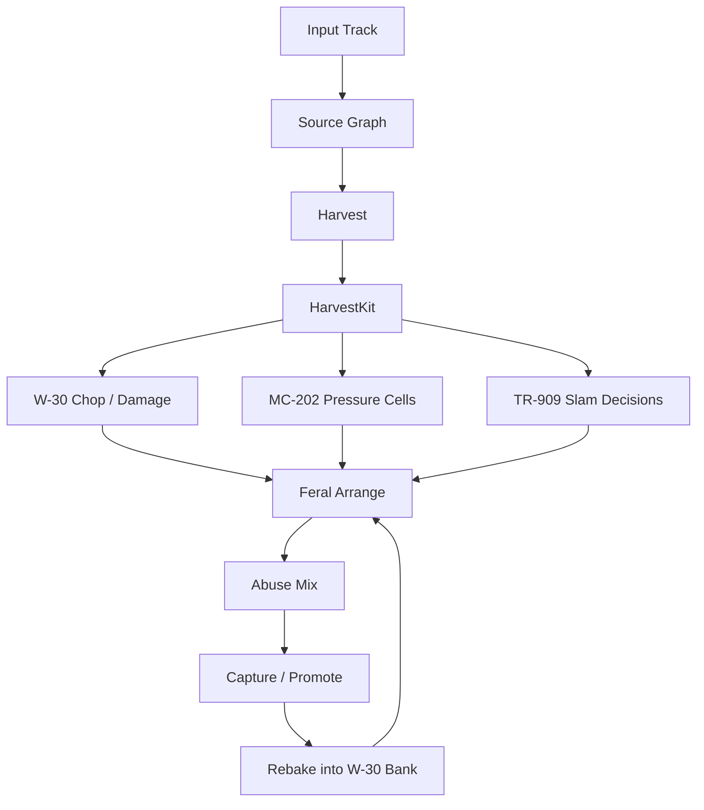
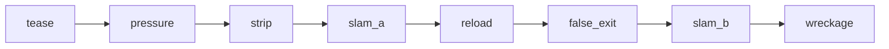
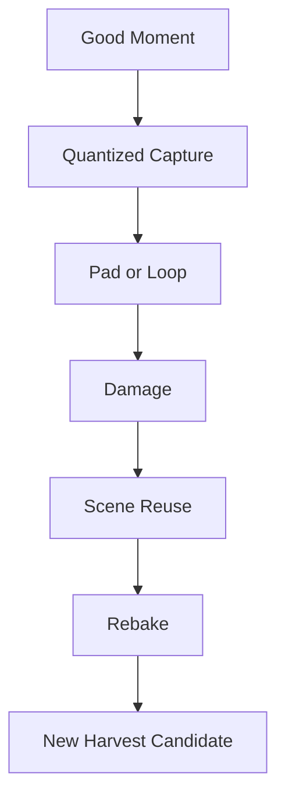
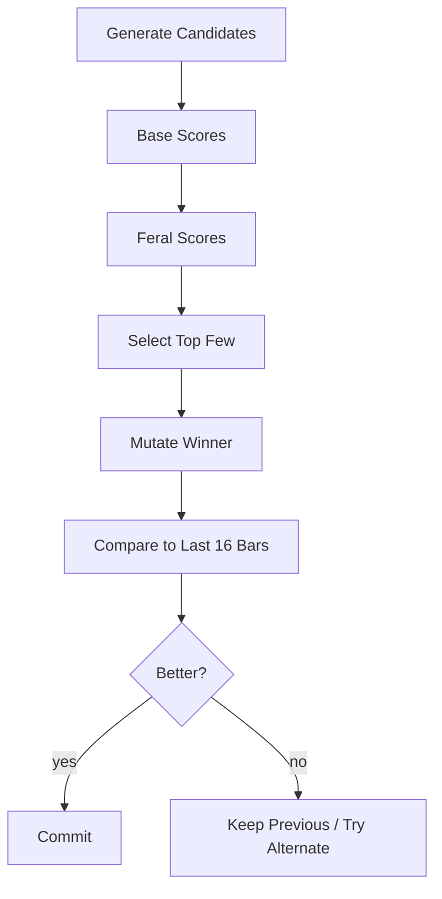

# Riotbox — Zusatzplan: Liam-/Feral-Rebuild-Profil

**Version:** 0.1  
**Status:** Addendum zum bestehenden Masterplan  
**Bezug:** ergänzt `plan/riotbox_masterplan.md`, ersetzt ihn nicht  
**Zweck:** präzisiert einen spezifischen kreativen Workflow für aggressive Re-Konstruktion von Eingangsaudio im Riotbox-System

---

## 1. Warum dieses Dokument existiert

Der bestehende Masterplan definiert bereits Architektur, Geräte-Persönlichkeiten, Sessionmodell, Ghost-System, Capture, Resampling, MVP und Phasen. Dieses Dokument führt **keine zweite Gesamtarchitektur** ein. Es beschreibt stattdessen ein **zusätzliches Profil**, das wir intern als **Liam-/Feral-Rebuild-Profil** behandeln können.

Dieses Profil operationalisiert eine sehr bestimmte Arbeitsweise:

- Material nicht als heilige Quelle behandeln, sondern als **Rohstofflager**.
- Nicht den ganzen Loop respektvoll weiterlaufen lassen, sondern **brauchbare Fragmente ernten**.
- Aus diesen Fragmenten neue Breaks, Hook-Scherben, Druck-Phrasen und Szenen bauen.
- Gute Momente sofort wieder einfrieren, sampeln, verbiegen und erneut verwenden.
- Das Ergebnis soll eher wie ein **hostiler Umbau** wirken als wie ein normaler Remix.

### Was dieses Dokument bewusst **nicht** macht

- keine neue Core-Architektur
- kein alternatives Sessionformat
- kein zweites Ghost-System
- keine neue Gerätefamilie neben MC-202, W-30 und TR-909
- kein separater Export- oder UI-Stack

### Was dieses Dokument ergänzt

- ein präzises Verhaltensprofil für einen bestimmten Rebuild-Modus
- zusätzliche Heuristiken für Auswahl, Zerstörung, Variation und Resampling
- neue Scores, Objekte, Ghost-Werkzeuge und Backlog-Deltas
- Merge-Regeln, damit keine Doppelarbeit mit dem Masterplan entsteht

---

## 2. Andockpunkte im bestehenden Masterplan

Dieses Addendum dockt an vorhandene Bereiche an, statt sie zu überschreiben.

| Masterplan | Bleibt im Masterplan | Dieses Addendum ergänzt |
|---|---|---|
| 11 Analyse-Pipeline | Decode, Stems, Grid, Harmonie, Sections, Slice-/Loop-Mining | **Harvest-Logik**, Feral-Tags, zusätzliche Auswahl- und Ausschlussregeln |
| 13.1 MC-202 | Mono-Lane, Follower/Instigator, `202_touch` | **Pressure-Cells**, Anti-Overplay-Regeln, Antwortphrasen |
| 13.2 W-30 | Slice Pool, Pad Forge, Loop Freezer, Resample Lab | **Damage-Profile**, Rebake-Workflow, Hook-Scherben, HarvestKit |
| 13.3 TR-909 | Reinforcement, Accent, Fill Brain, Slam Bus | **Underkick**, Backbeat-Sicherung, Strip/Slam-Vorbereitung |
| 14 Arrangement | Section Grammar, Phrase Generation, Micro Variation | **Feral-Szenentemplates**, Max-Copy-Guard, Eskalationskurven |
| 15 Scoring | Groove, Identity, Impact, Novelty, Restraint | **Feralness**, Broken-Hook-Score, Slam-Headroom, Bar-Variance |
| 23/24 Capture & Resample | Capture-first, Selbst-Sampling, Promotion in Szenen | **Harvest -> Rebake -> Reuse** als explizite Schleife |
| 31–33 MVP/Phasen/Backlog | Produktphasen und Modul-Backlog | **Delta-Aufgaben** für dieses Profil |

### Integrationsregel

Der Masterplan bleibt die **Quelle der Wahrheit für Systemstruktur**. Dieses Dokument ist die **Quelle der Wahrheit für das Feral-Rebuild-Profil**.

---

## 3. Kreative These des Profils

Das Profil soll **keinen Prodigy-Klon** und keinen „Style-Transfer“ bauen. Es soll einen Modus definieren, in dem Riotbox:

1. aus einem Eingangstrack die **brauchbarsten Konfliktpunkte** herauszieht,
2. diese Punkte rhythmisch, tonal und spektral **waffenfähig** macht,
3. daraus mehrere aggressive Rebuild-Kandidaten baut,
4. die besten davon live spielbar macht,
5. und gute Zwischenresultate sofort wieder in das System zurückführt.

Der Zielzustand pro Lauf ist nicht „fertiger Song aus Knopfdruck“, sondern eher:

- ein **HarvestKit** aus verwertbaren Ereignissen,
- mehrere **Break-Varianten**,
- eine oder mehrere **kaputte Hook-Scherben**,
- eine starke **MC-202-Druckzelle**,
- zwei bis sechs **brauchbare Eskalationskandidaten**,
- mindestens ein Moment, den man sofort capturen und weiterverwenden will.

### Erfolg bedeutet hier

- mehr Druck als das Original
- mehr rhythmische Dominanz als das Original
- weniger höfliche Kontinuität, mehr absichtliche Eingriffe
- trotzdem Wiedererkennung in DNA, Textur oder Geste
- nie bloß „denselben Song schmutziger gemacht“

---

## 4. Profilname, Betriebsart und Hauptregler

Arbeitsname im Code und in Presets:

```text
profile = feral_rebuild
subprofile = liam_workflow
```

Das Profil soll **kein neuer Top-Level-Modus** sein, sondern eine **Style-/Policy-Schicht** auf bestehenden Engines und Pipelines.

### Empfohlene Kernregler

Vorhandene Makros aus dem Masterplan bleiben gültig. Dieses Profil interpretiert sie nur schärfer.

```text
source_retain   0.0 .. 1.0   // wie viel echtes Quellmaterial hörbar bleibt
202_touch       0.0 .. 1.0   // wie stark die Mono-Lane Identität übernimmt
w30_grit        0.0 .. 1.0   // Bit-/Rate-/Sampler-Schmutz
909_slam        0.0 .. 1.0   // Punch, Accent, Fill- und Drop-Druck
mutation        0.0 .. 1.0   // Mutationsfreude allgemein
```

Zusätzliche Profil-Parameter:

```text
violence        0.0 .. 1.0   // wie radikal Material umgebaut wird
bar_variance    0.0 .. 1.0   // wie stark bar-by-bar Unterschiede erzwungen werden
hook_damage     0.0 .. 1.0   // wie verstümmelt und aggressiv Hook-Scherben verarbeitet werden
tail_cut        0.0 .. 1.0   // wie stark Slice-Ausläufe hart beschnitten werden
underkick       0.0 .. 1.0   // Stärke des 909-Unterkicks unter Breaks
rebake_bias     0.0 .. 1.0   // wie schnell interne Resultate zurück in W-30-Bänke gehen
```

### Wichtige Produktregel

Diese Zusatzparameter müssen **nicht alle im Jam-Screen sichtbar** sein. Für v1 dürfen sie intern aus vorhandenen Makros abgeleitet werden. Beispiel:

```text
violence    = f(mutation, w30_grit, 909_slam)
bar_variance= f(mutation, energy)
hook_damage = f(w30_grit, mutation)
```

Damit vermeiden wir UI-Aufblähung.

---

## 5. Erwartetes Verhalten nach einem MP3-Run

Wenn ein Benutzer einen Track lädt und das Feral-Profil aktiviert, sollte Riotbox **nicht** einfach nur ein anderes Arrangement desselben Materials erzeugen.

Ich würde stattdessen folgende Resultate erwarten:

### 5.1 Ein HarvestKit

Nicht der ganze Song zählt, sondern 20–80 verwertbare Atome:

- Kick-Fragmente
- Snares
- Ghost Notes
- Hats
- Stabs
- Vocal-Barks
- kurze Harmonieinseln
- Rausch-/Wasch-Anteile
- kleine Transienten mit Charakter

### 5.2 Mehrere Break-Varianten

Mindestens drei Varianten pro brauchbarem Kern:

- `break_A` = relativ nah am Quellgroove
- `break_B` = deutlich zerstückelt, aber noch lesbar
- `break_C` = aggressiv umgebaut, mit 909-Unterstützung

### 5.3 Eine kaputte Hook

Keine komplette Melodie, sondern eher:

- ein Wortrest
- ein halber Akkord
- ein kurzer Synth-Biss
- ein neu gesampelter Eigen-Sound
- ein mikrotonal verbogener Fragment-Ruf

### 5.4 Eine Druck-Lane

Die MC-202-Seite soll nicht alles zupflastern, sondern:

- Bassgewicht liefern,
- gegen Hooks antworten,
- in Builds an Spannung gewinnen,
- bei Bedarf im Drop die Identität übernehmen.

### 5.5 Mehrere Mix-Kandidaten

Nicht nur ein sauberer Export, sondern z. B.:

```text
cleaner_dirty_mix.wav
more_feral_mix.wav
wrecked_bus_print.wav
```

Das Profil lebt davon, dass nicht nur Pattern, sondern auch **Aggressionsgrade** getestet werden.

---

## 6. Feral-Pipeline

Die vorhandene Analyse- und Gerätearchitektur bleibt. Dieses Profil schaltet darüber eine **spezifische Produktionslogik**.



### 6.1 Stufe 1 — Harvest

Hier wird nicht nur analysiert, sondern **gezielt nach verwertbarer Gewalt** gesucht.

#### Ziel

Aus dem Source Graph ein kurzes, spielbares, wiederverwendbares **HarvestKit** machen.

#### Kandidatentypen

```text
kick
snare
ghost
hat
fill
wash
stab
chord_shard
vocal_bark
noise_hit
riser_fragment
```

#### Zusätzliche Harvest-Scores

Jeder Kandidat bekommt neben den vorhandenen Qualitätswerten weitere Profilwerte:

```text
transient_strength
backbeat_anchor_value
tail_cleanliness
aliasing_potential
slogan_potential
slam_headroom
reuse_flexibility
feral_uniqueness
```

#### Auswahlregeln

- bevorzuge Material mit **klarem Angriff**
- bevorzuge Material, das bei Pitching oder Rate-Shift **interessanter** wird
- bevorzuge leise Ghost-Events, wenn sie nach Verstärkung Charakter haben
- bevorzuge harmonische Scherben mit kurzer, markanter Identität
- vermeide langes, dichtes Material, das beim Zerlegen sofort zu Matsch wird

#### Ausschlussregeln

- zu breite, zu volle Flächen ohne saubere Transienten
- zu lange Rests mit zu viel Bleed
- zu komplexe Loops, die nur als Ganzes funktionieren
- Material, das nur im Vollmix verständlich ist

### 6.2 Stufe 2 — W-30 Chop / Damage

Diese Stufe setzt die Sampler-Logik um. Sie ist nicht bloß Slice-Editing, sondern **kontrollierte Misshandlung**.

#### Kernregeln

- **Tail Cut vor Schönheit**: lieber trockener, hackiger, als elegant ausklingend
- **Rate Shift vor Time Stretch**: Tonhöhe und Zeit dürfen gemeinsam kippen
- **Pitch als Waffe**: einzelne Slices dürfen extrem hoch oder tief gepitcht werden
- **Ghost Promotion**: kleine Nebenschläge dürfen zum Hauptreiz gemacht werden
- **Reverse sparsam, aber gezielt**: nur als Call, Pickup oder Drop-Vorbereitung

#### Damage-Profile

Jeder W-30-Pad-Kandidat kann ein Damage-Profil tragen:

```text
DamageProfile {
  tail_cut,
  grit,
  rate_shift,
  reverse_prob,
  drive,
  mono_narrow,
  room_send,
  transient_boost,
  pitch_bias
}
```

#### Wichtige Heuristiken

- ein Slice darf brutal kurz sein, wenn sein Attack stark bleibt
- Snares dürfen heller und hässlicher werden als im Original
- Ghost Notes dürfen überproportional verstärkt werden, wenn sie den Roll verbessern
- ein Break darf nicht länger als 2 Bars ohne Eingriff „einfach laufen“

### 6.3 Stufe 3 — MC-202 Pressure Cells

Die 202-Lane bleibt im Masterplan verankert. Dieses Profil verschärft nur ihre Regeln.

#### Gestaltungsprinzipien

- wenige Noten statt viele Noten
- 1- oder 2-Bar-Zellen statt endlose Phrasen
- Slides nur an Übergängen mit Funktion
- Accent dort, wo Form oder Reibung entsteht
- nicht „intelligent“, sondern **prägnant**

#### Rollen

```text
FOLLOWER   = stützt Source/Harmonie, baut Druck unten
ANSWER     = reagiert auf Hook- oder Drum-Pattern
INSTIGATOR = reißt Szene in neue Richtung
```

#### Verbote

- keine dichte Dauermelodie
- keine virtuose Ornamentik
- keine harmonische Dauererklärung jedes Akkords
- kein „Bassline-Gequatsche“ ohne dramaturgische Funktion

### 6.4 Stufe 4 — TR-909 Slam Decisions

Die 909-Rolle ist hier nicht nur Verstärkung, sondern **Entscheidungsmaschine für Schlagkraft**.

#### Hauptaufgaben

- fehlenden Tiefdruck unter Breaks liefern
- Backbeat lesbar halten, auch wenn das Break stark zerstört wird
- Drop-Vorbereitungen markieren
- Hats und Claps gezielt verdichten

#### Neue Zusatzlogik

**Underkick**:

- erkennt, ob das vorhandene Break genug Tiefdruck trägt
- legt 909-Kick darunter, wenn der Break körperlich nicht genug anschiebt
- variiert Decay und Lautheit je nach Szene

**Backbeat Guard**:

- wenn Snare/2-und-4 durch Zerlegung undeutlich werden, muss entweder
  - eine Snare-Schicht,
  - ein Clap,
  - oder eine Accent-Lösung die Form retten

**Pre-Drop Strip**:

- vor Drops darf das System einzelne Ebenen absichtlich wegnehmen
- Rückkehr muss spürbar heftiger sein als der Zustand davor

### 6.5 Stufe 5 — Feral Arrange

Der vorhandene Arranger wird nicht ersetzt. Dieses Profil ergänzt **Szenentemplates** und härtere Bewegungsregeln.



#### Empfohlene Szenenfamilie

```text
tease
pressure
strip
slam_a
reload
false_exit
slam_b
wreckage
```

#### Regeln

- nie mehr als **4 Bars ohne hörbare Variation**
- jeder Drop braucht vorab mindestens **eine Subtraktion**
- pro Phrase höchstens **eine harte Zerstörung** ohne Re-Orientierung
- pro 16 Bars mindestens **ein Merkmal**, das neu ist
- pro 32 Bars mindestens **ein Capture-würdiger Moment**

#### Variationstypen

- Slice-Tausch
- Snare-Ersatz
- halbe Bar Stille
- 202-Antwort
- Hook-Scherbe als Pickup
- Reverse-Call
- Hat-Dichte-Welle
- kurzer Komplettabriss mit sofortigem Restore

### 6.6 Stufe 6 — Abuse Mix

Diese Stufe lebt im vorhandenen Mixer-/FX-Konzept, bekommt hier aber ein klares Verhalten.

#### Ziel

Nicht High-End-HiFi, sondern **kontrollierte Brutalität**.

#### Bevorzugte Werkzeuge

- parallele Distortion
- Room-Send für Drum-Schub
- Filter-Fahrten mit groben Sprüngen statt glatter Kurven
- Bus-Kompression mit hörbarem Griff
- Bit- und Rate-Reduktion auf ausgewählten Elementen
- Mono-Narrowing für Hooks und aggressive Mittigkeit

#### Regel

Der Mix darf grob wirken, aber nicht zufällig zerfallen.

### 6.7 Stufe 7 — Capture / Promote / Rebake

Hier liegt der eigentliche Instrumentencharakter des Profils.

#### Grundidee

Nicht nur aus der Quelle sampeln, sondern **eigene Zwischenresultate wieder in den Sampler zurückführen**.



#### Rebake-Regeln

- gute 202-Phrase darf auf W-30-Pad gebounced werden
- aggressiver Drum-Bus darf als neues One-Shot-Material enden
- Hook-Scherbe darf durch erneutes Resampling noch unverständlicher, aber markanter werden
- jedes rebakte Objekt muss Herkunft im Provenance-System behalten

---

## 7. Datenmodell-Erweiterungen

Das bestehende Session-/Analysis-/Action-Modell bleibt. Ergänzt werden nur zusätzliche Objekte.

### 7.1 HarvestAtom

```text
HarvestAtom {
  id,
  source_span,
  stem,
  family,
  onset_confidence,
  transient_strength,
  tail_cleanliness,
  aliasing_potential,
  slogan_potential,
  slam_headroom,
  feral_uniqueness,
  tags[]
}
```

### 7.2 HarvestKit

```text
HarvestKit {
  track_id,
  bpm,
  key_hint,
  atoms[],
  loop_candidates[],
  hook_shards[],
  break_anchors[],
  notes
}
```

### 7.3 BreakVariant

```text
BreakVariant {
  id,
  source_atoms[],
  anchor_density,
  909_underkick,
  damage_profile,
  bar_variance,
  human_readable_label
}
```

### 7.4 HookShard

```text
HookShard {
  id,
  origin,
  source_atom_ids[],
  slogan_score,
  pitch_hint,
  mono_bias,
  damage_profile,
  replay_roles[]
}
```

### 7.5 FeralSceneIntent

```text
FeralSceneIntent {
  scene_type,
  energy_target,
  destruction_budget,
  rebuild_budget,
  source_retain,
  capture_priority,
  preferred_actions[]
}
```

### 7.6 Integrationsregel für Daten

- **Source Graph bleibt unverändert zentrale Wahrheit**
- **HarvestKit** ist ein abgeleitetes Arbeitsset
- **Pad Object** aus dem Masterplan bleibt die W-30-Zielform
- **Action Log** protokolliert jede Eskalation und jeden Rebake

---

## 8. Zusätzliche Scores

Die bestehenden Scores reichen grundsätzlich, aber das Profil braucht zusätzliche Kriterien.

### 8.1 Feralness Score

Misst, ob ein Kandidat genug Reibung, Aggression und Umbaupotenzial hat.

### 8.2 Broken Hook Score

Misst, ob eine Hook-Scherbe trotz Zerstörung merkbar bleibt.

### 8.3 Slam Headroom Score

Misst, ob ein Break oder Stem noch Platz für 909-Druck, Drive und Room hat.

### 8.4 Bar Variance Score

Misst, ob in den letzten Bars genug hörbare Veränderung stattfand.

### 8.5 Weapon Simplicity Score

Belohnt einfache, schneidende, merkbare Motive gegenüber detailverliebter Cleverness.

### 8.6 Candidate-Selektion



---

## 9. Ghost- und Agent-Integration

Der Ghost aus dem Masterplan bleibt. Dieses Profil erweitert nur das Aktionsvokabular.

### Zusätzliche Ghost-Werkzeuge

```text
harvest_track()
promote_atom(atom_id)
build_break_variant(anchor_id, violence)
forge_hook_shard(source_ids)
spawn_202_answer(scene_id)
slam_909_underbreak(scene_id)
strip_pre_drop(scene_id)
rebake_bus(bus_id)
restore_anchor(anchor_id)
```

### Zusätzliche Sicherheitsregeln

- nicht mehr als eine harte destruktive Aktion pro Phrase ohne Undo-Puffer
- vor jedem `rebake_bus()` muss Quelle und Ziel protokolliert werden
- Ghost darf keinen identischen Hook mehrfach als dominanten Mittelpunkt promoten
- Ghost soll bei starker Zerstörung mindestens einen Anker bewusst erhalten

### Erwartete Ghost-Erklärungen

```text
[bar 33] ghost: promoted ghost-note cluster because break lost internal motion
[bar 41] ghost: layered underkick to restore physical impact under chopped break
[bar 49] ghost: rebaked distorted hook shard into W30 bank C, pad 2
```

---

## 10. UI- und Bedienintegration

Um Konflikte mit dem bestehenden TUI-Konzept zu vermeiden, führt dieses Profil **keine neuen Hauptseiten** ein. Es erweitert nur bestehende Seiten.

### Jam-Screen

Zusätzliche lesbare Zustände:

```text
HARVEST atoms 46 hooks 7 anchors 5 danger 0.63
FERAL violence 58 variance 44 rebake 39 retain 27
```

### W30-Seite

- Harvest Pool
- Damage-Profil-Auswahl
- Rebake Queue
- Hook Shard Browser

### TR909-Seite

- Underkick-Intensität
- Backbeat Guard Status
- Strip/Slam-Prep

### Arrange-Seite

- Feral-Szenentemplates
- Bar-Variance-Meter
- Capture Priority

### Bedienregel

Neue Shortcuts nur dann global einführen, wenn sie im späteren TUI-Spec nicht mit bestehenden Belegungen kollidieren. Für dieses Dokument reicht die funktionale Beschreibung; konkrete Tastenbelegung bleibt ein späteres Integrationsdetail.

---

## 11. Merge-Regeln zur Vermeidung von Doppelarbeit

Das ist der wichtigste praktische Teil für parallele Agentenarbeit.

### 11.1 Was **nicht** neu gebaut werden darf

- kein zweiter Loop Miner neben dem bestehenden Analysis Sidecar
- kein eigenständiger „Liam Engine“-Ordner neben `devices_w30`, `devices_mc202`, `devices_tr909`
- kein separates Exportsystem
- kein eigenes Sessionformat
- kein eigener Agent außerhalb des Ghost-Systems

### 11.2 Wo dieses Profil technisch leben sollte

```text
python/sidecar/pipelines/harvest.py
python/sidecar/scoring/feral.py
crates/arranger/src/profiles/feral.rs
crates/devices_w30/src/rebake.rs
crates/devices_w30/src/damage.rs
crates/devices_tr909/src/underkick.rs
crates/devices_mc202/src/pressure_cells.rs
tests/golden/feral_*.json
```

### 11.3 Dokumentationsort

Dieses Dokument gehört in:

```text
plan/riotbox_liam_feral_addendum.md
```

Spätere Ausdetaillierungen gehören **nicht** wieder unter `plan/`, sondern in die passenden Specs unter `docs/`.

### 11.4 Produktregel

Alles, was hier beschrieben ist, soll im Code als **Profil / Policy / Preset-Familie** sichtbar werden, nicht als Sonderfall-Hardcode quer durchs Projekt.

---

## 12. Backlog-Delta zum Masterplan

Die folgenden Aufgaben sind **zusätzlich** zu den bestehenden Backlog-Punkten gedacht und sollen in die vorhandenen Module einsortiert werden.

### Analysis Sidecar

- [ ] Harvest-Scorer für `transient_strength`, `tail_cleanliness`, `aliasing_potential`
- [ ] Klassifikation für `vocal_bark`, `hook_shard`, `break_anchor`
- [ ] Break-Adjacency-Graph für rekombinierbare Slices
- [ ] Heuristik für Ghost-Note-Promotion
- [ ] Hook-Scherben-Kandidaten aus Harmonie- und Vocal-Resten

### MC-202

- [ ] Pressure-Cell-Generator für 1- und 2-Bar-Zellen
- [ ] `ANSWER`-Rolle zusätzlich zu Follower/Instigator
- [ ] Anti-Overplay-Regeln und Note-Budget
- [ ] Weapon-Simplicity-Scoring für Mono-Zellen

### W-30

- [ ] Damage-Profile-System
- [ ] Hard Tail Cut / Dry Gate Routine
- [ ] Rebake Queue und Provenance-Tracking
- [ ] Hook Shard Browser
- [ ] Capture -> Pad -> Szene Promotion ohne Medienbruch

### TR-909

- [ ] Underkick-Entscheidungslogik
- [ ] Backbeat Guard
- [ ] Strip-Prep- und Slam-Prep-Zustände
- [ ] Decay-/Accent-Profile nach Szene

### Arrangement

- [ ] Feral-Szenentemplates (`pressure`, `strip`, `slam_a`, `reload`, `slam_b`, `wreckage`)
- [ ] Max-Copy-Guard über 4 Bars
- [ ] Capture-Worthy-Moment-Heuristik
- [ ] Eskalationskurve über 16-/32-Bar-Fenster

### Scoring

- [ ] Feralness Score
- [ ] Broken Hook Score
- [ ] Slam Headroom Score
- [ ] Bar Variance Score
- [ ] Weapon Simplicity Score

### Ghost / AI Agent

- [ ] Tool-Schema für `harvest_track`, `build_break_variant`, `rebake_bus`
- [ ] Ghost-Erklärungen für Destruktionsentscheidungen
- [ ] Budget-Regeln für Eskalation vs. Restore

### QA / Golden Tests

- [ ] Regression-Fälle für „zu höflicher Rebuild“
- [ ] Regression-Fälle für „zu matschige Zerstörung“
- [ ] Fixture: gleicher Input, gleiche Seeds, gleiche HarvestKit-Auswahl
- [ ] Fixture: Rebake bleibt reproduzierbar
- [ ] Fixture: Max-Copy-Guard greift hörbar

---

## 13. Phasen-Delta

Dieses Profil ändert die Phasen nicht, erweitert sie nur.

### Phase 2 — Analyse-Vertical-Slice

Zusätzlich liefern:

- erstes HarvestKit v1
- erste Break-Anker
- erste Hook-Scherben-Kandidaten

### Phase 3 — TR-909 MVP

Zusätzlich liefern:

- Underkick v1
- Backbeat Guard v1
- Strip-/Slam-Vorbereitung

### Phase 4 — MC-202 MVP

Zusätzlich liefern:

- Pressure Cells v1
- Answer-Phrasen
- Anti-Overplay-Regeln

### Phase 5 — W-30 MVP

Zusätzlich liefern:

- Damage Profiles v1
- Rebake Queue v1
- Hook-Shard-Capture

### Phase 6 — Scene Brain

Zusätzlich liefern:

- Feral-Szenenfamilie
- Max-Copy-Guard
- Capture-Worthy-Moment-Heuristik

### Phase 7 — Ghost / AI Assist

Zusätzlich liefern:

- Feral-Tooling
- Erklärbare Destruktionsaktionen
- Restore-Strategien nach zu starker Eskalation

### Phase 8 — Pro Hardening

Zusätzlich liefern:

- Golden Renders für Feral-Profil
- deterministische Rebake-Replays
- robuste Fehlertests für aggressive FX-/Capture-Ketten

---

## 14. Erwartete Artefakte pro Lauf

Ein einzelner Lauf mit diesem Profil darf ruhig mehrere Zwischenprodukte hinterlassen.

```text
runs/042/
  source_graph.json
  harvest_kit.json
  break_variants/
    break_A.seq
    break_B.seq
    break_C.seq
  hook_shards/
    shard_01.wav
    shard_02.wav
  pads/
    bank_B.json
    bank_C.json
  scenes/
    pressure.scene
    slam_a.scene
    slam_b.scene
  exports/
    cleaner_dirty_mix.wav
    more_feral_mix.wav
    stems/
  logs/
    actions.log
    ghost.log
  replay/
    session_snapshot.json
```

### Warum das sinnvoll ist

Das Profil soll nicht so tun, als gäbe es nur einen „richtigen“ Output. Der Wert liegt gerade darin, dass aus einem Track mehrere **brauchbare Fehlformen** hervorgehen können.

---

## 15. Definition of Done für dieses Profil

Das Feral-Profil gilt als brauchbar, wenn bei geeignetem Quellmaterial Folgendes möglich ist:

- aus einem Input-Track entstehen mindestens **20–80 Harvest-Atome**
- mindestens **3 brauchbare Break-Varianten** sind erzeugbar
- mindestens **1 Hook-Scherbe** bleibt trotz Beschädigung merkbar
- die 202-Lane kann **Follower, Answer oder Instigator** spielen
- pro 16 Bars gibt es **hörbare Bewegung**
- pro 32 Bars gibt es mindestens **einen Capture-würdigen Moment**
- Ghost kann Eskalationen ausführen, ohne Undo oder Replay zu zerstören
- derselbe Run ist mit gleichem Input, Seed und Action Log reproduzierbar

### Negativkriterien

Das Profil ist **nicht** gelungen, wenn:

- das Ergebnis bloß wie ein normaler Remix klingt
- komplette Quellloops zu lange unberührt laufen
- die 202-Lane alles zuredet
- der Mix nur laut und kaputt ist, aber keine Form mehr hat
- Capture/Rebake eher Debug-Funktion als kreatives Herzstück bleibt

---

## 16. Schlussregel für die Integration

Wenn es bei der Umsetzung Konflikte gibt, gilt für dieses Profil in genau dieser Reihenfolge:

1. **Masterplan-Architektur vor Profil-Eskapade**
2. **Profil als Policy vor Sonderfall-Hardcode**
3. **Capture/Rebake vor zusätzlicher Feature-Masse**
4. **prägnanter Output vor algorithmischer Cleverness**
5. **mehrere starke Kandidaten vor einem angeblich perfekten Volltreffer**

---

## 17. Kurzfassung in einem Satz

> Das Liam-/Feral-Rebuild-Profil macht Riotbox nicht zu einem zweiten Produkt, sondern zu einem gezielt aggressiven Arbeitsmodus, in dem Input-Audio geerntet, zerstückelt, verdichtet, live eskaliert, gecaptured und wieder zurück in das Instrument gesampelt wird.
