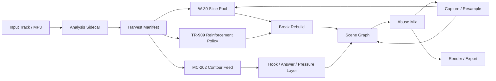
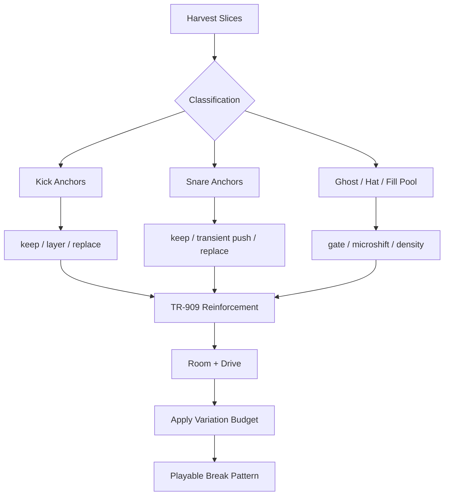
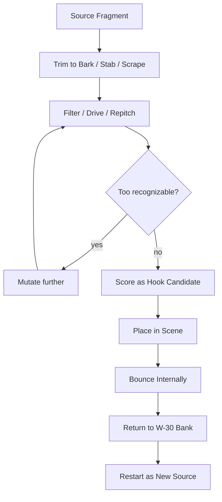

# Riotbox - Feral Reconstruction Addendum

**Recommended canonical repo path:** `plan/riotbox_liam_howlett_feral_addendum.md`  
**Status:** complementary feature and integration plan  
**Language:** English  
**Purpose:** This addendum extends `riotbox_masterplan.md` with a precise, merge-friendly specification for the feral rebuild workflow: the decision logic that turns arbitrary source audio into useful fragments, rebuilt breaks, damaged / resampled hooks, and aggressive reconstruction patterns.

---

## 1. Role of This Document

This document does **not** replace the masterplan.  
It is deliberately written as an **addendum**, so it can evolve alongside the base concept without duplicating architecture, backlog, or terminology.

### 1.1 What this document does

It specifies the stylistic and procedural logic for a run like:

```text
MP3 in
-> analysis
-> harvest
-> slice / hook selection
-> break rebuild
-> hook resample
-> aggressive scene logic
-> abuse mix
-> capture / resample / export
```

### 1.2 What this document explicitly does not do

- define a new overall architecture
- require additional top-level engines
- plan an "in the style of Liam" prompt mechanism
- recommend end-to-end style transfer
- override ownership already defined in `riotbox_masterplan.md`
- propose copyright-avoidance tricks
- become a mastering or release-finalizer document
- turn into a research project for perfect forensics or stem separation

### 1.3 Clear non-goals

This addendum is **not** for:

- perfect 1:1 hardware emulation
- reconstructing famous Prodigy tracks
- maximizing source recognizability
- forcing every input into a "finished song"
- replacing human curation or live performance

The desired result is instead: **useful, aggressive intermediate forms** with clear artifacts that can be played, curated, captured, abused, and reused.

### 1.4 Merge rule against overlap

This addendum sits on top of the existing system as a **behavior layer**:

- **Analysis Sidecar** owns audio analysis and candidate finding
- **W-30 / sample layer** owns slices, pads, capture, and resample
- **TR-909 / drum layer** owns reinforcement, slam, and drum mutation
- **Arranger / Scene Brain** owns scenes, energy, and transitions
- **FX / Mixer / Capture** owns dirt, space, drive, and bounce

This document mainly contributes:

- decision rules
- style profiles
- additional data fields
- macro semantics
- backlog deltas
- acceptance criteria

---

## 2. Central Thesis

The right kind of automation here is **not**:

> "Make this song sound like artist X."

The right kind of automation is:

> "Make decisions like a ruthless sampler / sequencer producer: tear apart, select, harden, rebuild, vary, capture, resample, attack again."

The target is **decision automation rather than surface imitation**.

---

## 3. Style Assumptions Translated into Product Behavior

Documented Liam-style production habits can be translated into design impulses:

1. Tracks were built by hand rather than copied mechanically.
2. Drums were often rebuilt from snippets of real breaks instead of using whole stock loops.
3. Breakbeats gained extra kick reinforcement, room, and pressure.
4. Samples were raw material; the point was to build something on top of them, not simply replay them.
5. The W-30 acted as sequencing center, not as nostalgic decoration.
6. Own synth sounds and a few hard fragments mattered more than full quoted hook phrases.

For Riotbox this means:

- no whole-loop thinking
- bar-by-bar variation
- more reconstruction than playback
- more attack than polish
- resample as a core workflow
- hook fragments rather than hook theft

---

## 4. Merge-Compatible Mapping to the Existing Plan

### 4.1 Ownership matrix

This table is the single strongest guard against duplication.

| Capability | Owner | Reads | Writes | Must not duplicate |
|---|---|---|---|---|
| Decode, beat grid, sections, transients, embeddings | Analysis Sidecar | input audio | analysis features, slice candidates, loop candidates | sampler / pattern behavior |
| Harvest selection and slice / hook scoring | Analysis Sidecar + policy layer | analysis features | `HarvestManifest`, `quote_risk`, `feral_potential` | new audio engine |
| Slice pool, pad banks, hook banks, resample recapture | W-30 / sample layer | harvest candidates, internal bounces | pads, hook fragments, self-samples | drum reinforcement logic |
| Kick / snare anchors, punch, slam, room-drum policy | TR-909 / drum layer | pattern drafts, anchor hits | reinforcement events, drum layering | hook or pad management |
| Bar variation, strip / slam, destroy / rebuild, scene budgets | Arranger / Scene Brain | break candidates, hook candidates, macro state | scene graph, variation events | new analysis pipeline |
| Dirt, drive, room, parallel, bounce, render variants | FX / Mixer / Capture | scene graph, audio buses | capture artifacts, renders | composition logic |
| Promotion, favorites, style reasoning, safe auto-actions | Ghost / agent layer | logs, scores, run artifacts | promotions, action log, safe mutations | shadow arrangement engine |

### 4.2 Mapping into existing masterplan areas

| Existing area | Existing responsibility | Addendum adds | Must not duplicate |
|---|---|---|---|
| Analysis pipeline | beat, sections, loops, slices, embeddings | `HarvestManifest`, feral scoring, hook-fragment mining | new overall analysis stack |
| W-30 engine | slice pool, pad forge, resample lab, capture | tail chop, hook-bark forge, pad prioritization, internal reuse logic | second sampler system |
| TR-909 engine | drum reinforcement, fill, slam | anchor-punch rules, snare layering, room / drive policy | second drum engine |
| Arrangement | section grammar, scene templates, mutation rules | bar-by-bar variation, destroy / rebuild cycles, feral scene budgets | new arranger architecture |
| Capture / Resample | secure and reuse moments | automatic promotion flow, self-sampling priority | separate bounce system |
| FX / Mixer | drive, filter, room, compression | abuse-mix recipes, dirt buses, render variants | mastering-only subsystem |

### 4.3 Naming compatibility with other planning material

If terms from `conversation_creating_riotbox_masterplan.txt` are reused, the mapping is:

- **Harvest** <-> Analysis Sidecar + loop miner + pad forge
- **Breaksmith** <-> W-30 slice pool + TR-909 reinforcement + drum FX
- **RiffForge** <-> W-30 Resample Lab + hook-fragment layer + MC-202 answer logic
- **Feral Arrange** <-> Arranger + Scene Brain + mutation rules
- **Abuse Mix** <-> mixer / FX + capture / resample

That keeps one core architecture while allowing a strong additional policy layer.

### 4.4 Conflict rules for parallel planning

If this addendum is merged with other planning threads:

1. **No new engines without an owner.** New terms may appear as policy, data objects, or presets only until a real module decision exists.
2. **One problem, one owner.** If two documents cover the same problem, the owning module's document wins; this addendum then only contributes style rules.
3. **New scores need consumers.** Every new score such as `feral_potential`, `bite_score`, or `quote_risk` must have an explicit consumer.
4. **Artifacts over prose.** If prose and a concrete run-artifact schema conflict, the artifact definition wins.
5. **Ghost may not create a shadow architecture.** Agent actions may trigger decisions, but not hide a second arrangement or mix system.

---

## 5. Expected Output of a Single Run

A run should **not** primarily produce a "finished song." It should produce a set of useful artifacts with audible identity.

### 5.1 Example target image for run output

The following directory is a **target image for useful run artifacts**, not a binding MVP file tree and not a final export contract.

```text
run-0042/
  manifest.json
  source_summary.json
  slices/
    001_kick.wav
    002_snare.wav
    003_ghost.wav
    ...
  loops/
    loop_A.wav
    loop_B.wav
  hooks/
    bark_01.wav
    stab_02.wav
    scrape_03.wav
  patterns/
    break_A.json
    break_B.json
    break_C.json
    hook_call.json
    hook_answer.json
  captures/
    cap_01.wav
    cap_02.wav
  renders/
    dirty_mix.wav
    more_feral_mix.wav
    drums_only.wav
    hook_bus.wav
  reports/
    feral_scorecard.json
    quote_risk.json
```

### 5.2 What a good run should yield

- 20-80 usable single events
- 4-12 good hook fragments
- 3-5 usable break-pattern variants
- at least 1 internally resampled follow-up object
- 2 mix variants with different aggression levels
- enough structure that the user can immediately keep performing or curating

### 5.3 Golden path for a v1 run

Assumption: the user chooses a 2-5 minute MP3 with clear rhythmic events and some spectral motion.

#### Step 1 - Harvest

The system might produce:

- 36 slice candidates
- 6 kick / snare anchors
- 9 ghost / hat / fill candidates
- 7 hook fragments
- 3 useful loop windows
- 1 `HarvestManifest`

#### Step 2 - Break rebuild

From the harvest data:

- `break_A.json` with high source loyalty
- `break_B.json` with stronger 909 punch
- `break_C.json` with harder tail chop and ghost density

#### Step 3 - Hook forge

After `quote_guard` and bite scoring, 7 candidates might collapse to:

- `bark_01.wav`
- `stab_02.wav`
- `scrape_03.wav`

#### Step 4 - Arrange

The arranger builds an initial scene chain:

```text
tease -> build -> strip -> slam -> switchup -> final
```

#### Step 5 - Abuse + capture

During first playback, the system promotes at least one internal bounce, for example:

- `captures/cap_01.wav` from hook + room + drive
- `hooks/bark_01_resampled.wav` as source for the second half

#### Step 6 - Useful output

The run is useful if the user gets:

- at least 3 pattern variants
- at least 1 recurring hook cell
- at least 1 internally generated follow-up object
- at least 2 clearly different renders
- a `feral_scorecard.json` that explains why the run was strong or weak

This is intentionally **not** a one-click full-song promise. It is the smallest meaningful form of a feral creative run.

---

## 6. New Additive Data Objects

The existing data-model logic remains in place; this addendum only proposes feral-oriented annotations.

Important:

- The following data objects are **rough conceptual proposals**, not frozen Rust, serde, or JSON schemas.
- They become binding only later in `docs/specs/`, especially in the `Source Graph Spec`, `Session File Spec`, and related contract documents.
- If later core specs differ, these examples are directional, not mandatory.

### 6.1 `HarvestManifest`

```rust
HarvestManifest {
  run_id: String,
  source_ref: String,
  bpm_hypotheses: Vec<BpmHypothesis>,
  key_hypotheses: Vec<KeyHypothesis>,
  slice_count: usize,
  loop_count: usize,
  hook_fragment_count: usize,
  texture_count: usize,
  top_candidates: Vec<CandidateRef>,
  feral_profile: FeralProfileRef,
  provenance_mode: ProvenanceMode,
}
```

### 6.2 `HarvestSlice`

```rust
HarvestSlice {
  id: SliceId,
  stem: StemKind,
  bar_pos: BarPos,
  sample_start: u64,
  sample_end: u64,
  class: SliceClass,
  transient_strength: f32,
  brightness: f32,
  body_ms: f32,
  tail_ms: f32,
  pitch_center: Option<f32>,
  recognizability: f32,
  feral_potential: f32,
  quote_risk: f32,
  provenance: ProvenanceRef,
}
```

### 6.3 `HookFragment`

```rust
HookFragment {
  id: HookId,
  source_slice_ids: Vec<SliceId>,
  class: HookClass,
  phrase_len_beats: f32,
  recurrence_score: f32,
  bite_score: f32,
  transform_distance: f32,
  recognizability: f32,
  quote_risk: f32,
  suggested_chain: AbuseChainRef,
}
```

### 6.4 `PatternMutationRecipe`

```rust
PatternMutationRecipe {
  id: RecipeId,
  anchor_policy: AnchorPolicy,
  replacement_budget_per_bar: u8,
  microtiming_policy: MicroTimingPolicy,
  gate_policy: GatePolicy,
  reinforcement_policy: ReinforcementPolicy,
  room_send: f32,
  drive_amount: f32,
  resample_depth: u8,
}
```

### 6.5 `FeralScorecard`

```rust
FeralScorecard {
  run_id: String,
  bar_variation_index: f32,
  source_retain_ratio: f32,
  resample_reuse_ratio: f32,
  drum_anchor_stability: f32,
  hook_transform_distance: f32,
  quote_risk_max: f32,
  capture_yield: f32,
}
```

---

## 7. Extensions to the Source Graph and Session Model

### 7.1 Source Graph

The existing Source Graph should gain feral-relevant views such as:

- `feral.slice_classes`
- `feral.anchor_hits`
- `feral.hook_fragments`
- `feral.texture_hits`
- `feral.quote_risk_regions`
- `feral.preferred_break_windows`
- `feral.rejection_reasons`

### 7.2 Session model

Possible additional session fields:

- `feral_profile`
- `harvest_manifest_ref`
- `approved_hook_ids`
- `rejected_quote_ids`
- `favorite_capture_ids`
- `resample_generation_depth`
- `style_reason_log`

This helps keep stylistic decisions replayable and explainable.

---

## 8. End-to-End Workflow

### 8.1 Overall pipeline



### 8.2 Phase A - Harvest

Goal:

Treat the source not as a file, but as a set of reusable events.

Pipeline:

1. decode / normalize
2. optional stem separation
3. beat / downbeat / bar grid
4. transient detection
5. generate slice candidates
6. assign coarse classes
7. find loop candidates and hook fragments
8. score feral potential and quote risk
9. write results into `HarvestManifest`

Prefer candidates with:

- clear attack
- good body / tail balance
- reuse value under pitch / gate change
- medium recognizability
- strong bite
- good placement on strong beats

Down-rank candidates with:

- too much masking
- long uncontrolled tails
- already "finished" hook behavior
- high recognizability
- brickwall mud
- weak transient identity

Harvest is **not** a passive report. It is the first creative selection step.

### 8.3 Phase B - Break rebuild

This stage does not replay a break. It rebuilds one from slices.

Core rules:

- strong metric points remain readable
- some events are replaced or layered
- ghosts, hats, and fills provide motion
- 909 material adds punch
- room and drive add aggression
- variation keeps happening, not only at scene boundaries

Anchor policy at early / moderate aggression:

- preserve downbeat kick identity
- preserve backbeat snare logic
- preserve core hat / ghost movement

Preferred replacement targets:

- weak kicks
- dull snare transients
- boring offbeats
- repetitive hat chains
- overly clean in-between space

Variation clock:

- every 2 bars: micro changes
- every 4 bars: ghost / hat gate or accent variant
- every 8 bars: fill, strip, or layer shift
- every 16 bars: break recut or hook answer
- every 32 bars: destroy / rebuild or section reinterpretation

Aggression levels:

**`retain`**

- few interventions
- subtle 909
- source remains recognizable

**`shred`**

- 1-3 replacements per bar
- stronger gate shortening
- more room / drive
- internal rebuild becomes obvious

**`riot`**

- anchors stay but much in-between content is rebuilt
- 909 becomes more assertive
- rapid fill / density shifts
- capture probability rises

### 8.4 Break-Rebuild Decision Diagram



### 8.5 Phase C - Hook / Fragment Forge

The hook layer should not rescue the full chorus. It should create small, toxic fragments.

Candidate types:

- short vocal bark
- single chord stab
- guitar or texture scrape
- one note with strong envelope
- crooked chord sliver
- hard one-shot with repitch potential

Hook strategy:

1. do not keep the whole phrase
2. extract only the most useful cell
3. filter / distort / pitch it
4. optionally resample again
5. place it as call or answer
6. use it as source in later passes

### 8.6 Hook-Resample Loop



Prefer:

- high `bite_score`
- good repeatability over 1-2 bars
- clear function as call or slogan-like strike
- low full-quote danger
- compatibility with mono bass and drum punch

Down-rank:

- over-complete melody
- long phrases
- iconic fragments
- soft fragments
- pads without attack
- material without transient character

### 8.6.1 MC-202 Interaction

The 202 should not double the hook. It should choose a role:

- `shadow`: follow contour loosely
- `answer`: respond to bark / stab
- `pressure`: hold offbeat pressure
- `instigate`: push the scene elsewhere

### 8.7 Phase D - Feral Arrange

The arranger keeps the same architecture but adopts a clearer style policy.

Principle:

The arrangement should feel **built**, not looped.

Suggested scene logic:

```text
tease -> reveal -> build -> strip -> slam -> switchup -> breakdown -> slam_b -> final -> exit
```

Scene tendencies:

**`tease`**

- higher source loyalty
- hooks only hinted
- 202 stays backgrounded

**`build`**

- density rises
- drum layering increases
- hook fragments prepare the payoff

**`strip`**

- partial removal of hats or source layers
- expectation rises
- new capture moments appear

**`slam`**

- 909 slam opens up
- hook becomes clearer
- break is fully reconstructed
- drive / room rise

**`switchup`**

- different slice family
- different hook bank
- different 202 role

**`breakdown`**

- create space
- foreground resampled material
- refocus identity

Variation clock:

- 2 bars: micro variation
- 4 bars: gate / accent / density shift
- 8 bars: fill / strip / layer swap
- 16 bars: hook or break mutation
- 32 bars: redefine scene role

### 8.8 Phase E - Abuse Mix

The mix is not neutral finishing. It is part of the sound design.

Desired result:

- punchy
- dry or thrashy
- aggressive
- deliberately roughened
- still controllable

Suggested buses:

- source bus
- break bus
- hook bus
- MC-202 bus
- dirt bus
- room bus
- master bus

Abuse operations:

- drive / overload
- filter before and after distortion
- light bit reduction
- selective rate reduction
- short room sends
- parallel compression
- tail chop / gate shortening
- internal resample

Rule:

Do not tear everything open at once. Aggression should be **scene-dependent** and **budgeted**.

### 8.9 Phase F - Capture and Self-Sampling

The system becomes truly interesting once it **collects strong moments and reuses them**.

Promotion rules:

A moment may be auto-promoted when:

- `bite_score` is high enough
- `quote_risk` stays below threshold
- the pattern context is stable
- it works in at least 2 passes
- in the mix it is not only "nice" but functional

Promotion targets:

- pad
- hook-bank entry
- loop
- scene favorite
- resample source

Hard product rule:

**After the first resample cycle, internally generated material may have equal or higher priority than original source material.**

That is what turns Riotbox from a clever remix tool into an instrument with its own life.

---

## 9. Macro Semantics Without Jam-Screen Bloat

The existing macro set from the masterplan remains valid. This addendum sharpens the meaning.

### 9.1 Existing macros, refined

**`source_retain`**  
How much of the original may remain audible.

- high: closer to mutation / remix
- low: stronger rebuild

**`202_touch`**  
How dominant the MC-202 becomes.

- low: only pressure / answers
- high: rebuild identity shifts toward the mono lane

**`w30_grit`**  
How strongly the W-30 sample-abuse mentality appears.

- pitch / rate artifacts
- bit / tail behavior
- capture / resample appetite

**`909_slam`**  
How hard punch, layering, and drum-bus aggression intervene.

**`mutation`**  
How much gets replaced or bent per variation unit.

**`density`**  
How tightly ghosts, hats, hook hits, and counter-moves are packed.

**`energy`**  
Scene pressure rather than mere loudness.

**`ghost_aggression`**  
How far the agent may go autonomously.

### 9.2 Deep controls for Sculpt / Lab only

Not needed on the main screen, but useful deeper down:

- `break_shred`
- `hook_bite`
- `tail_chop`
- `room_thrash`
- `quote_guard`
- `resample_depth`

---

## 10. Ghost / Agent Behavior

The agent should not invent these style rules from nowhere. It should visibly apply them.

### 10.1 Allowed Ghost actions

- promote a good slice
- discard a weak hook
- strip hats before a drop
- raise 909 slam for the next phrase only
- write an internal bounce into a new pad bank
- swap hook fragments
- reinterpret a scene after a successful capture

### 10.2 Ghost explainability

Meaningful actions should be explainable, for example:

```text
[bar 25] ghost: replaced weak snare transient with layered push, quote risk unchanged
[bar 33] ghost: promoted resampled bark_02 to hook bank, bite_score +0.21
[bar 41] ghost: stripped hats for 4 beats before slam section
```

---

## 11. Concrete Backlog Deltas Relative to the Masterplan

### 11.1 Delta for 33.3 Analysis Sidecar

Add:

- `feral_potential` scoring
- hook-fragment mining
- `quote_risk` per slice / fragment
- anchor detection for kick / snare positions
- repetition index per bar
- rejection reasons in the harvest manifest

### 11.2 Delta for 33.5 W-30

Add:

- tail-chop engine
- bark / stab / scrape extraction
- hook-bank prioritization
- per-pad abuse chain
- internal resample generations
- promotion of self-sampled pads

### 11.3 Delta for 33.6 TR-909

Add:

- kick-reinforcement chooser
- snare transient push
- ghost / hat density model
- room / drive policy by scene
- slam bus with limited activation budget

### 11.4 Delta for 33.7 Arrangement

Add:

- bar-variation scheduler
- destroy / rebuild triggers
- strip / slam policy
- hook-answer policy
- source-retention budget
- capture-driven scene promotion

### 11.5 Delta for 33.9 AI Agent

Add:

- style reasons in the action log
- quote-risk limits
- promotion decisions
- variation budgets
- negative diagnoses such as "too static", "too iconic", "too clean"

---

## 12. Plugging Into the Implementation Phases

### 12.1 Phase 2 - Analysis vertical slice

Add:

- `HarvestManifest v1`
- slice classes
- first hook-fragment detection
- rejection reasons

Exit addition:  
an input track yields a usable candidate list instead of analysis numbers only.

### 12.2 Phase 3 - TR-909 MVP

Add:

- kick / snare reinforcement rules
- slam / room as scene parameters
- anchor preservation during mutation

Exit addition:  
drums feel reconstructed, not merely replaced.

### 12.3 Phase 4 - MC-202 MVP

Add:

- `answer`, `pressure`, and `instigate` roles
- hook-response rules instead of hook doubling
- contour follower with feral simplification
- note budget against overplay

Exit addition:  
the 202 lane adds pressure and identity without talking over hook and break.

### 12.4 Phase 5 - W-30 MVP

Add:

- bark / stab / scrape banks
- tail chop
- self-sampling loop
- hook fragments on pads

Exit addition:  
a run yields useful hook and break building blocks.

### 12.5 Phase 6 - Scene Brain

Add:

- variation clock
- strip / slam / switchup policy
- destroy / rebuild event rules

Exit addition:  
playback no longer sounds like a static 8-bar loop.

### 12.6 Phase 7 - Ghost layer

Add:

- promotion logic
- quote-risk guards
- style-aware mutation
- explainable feral actions

Exit addition:  
Ghost can perform stylistically strong actions visibly and safely.

### 12.7 Phase 8 - Pro hardening

Add:

- feral regression renders
- repetition checks
- quote-risk checks
- capture-yield metrics

Exit addition:  
the system delivers consistent runs with audible self-motion.

---

## 13. Preset and Profile Extensions

The existing style families remain good. This addendum suggests giving them clearer behavioral dimensions.

### 13.1 Meta-profile: `feral_rebuild`

Defines:

- medium to high break reconstruction
- hook fragments rather than full phrases
- moderate to strong 909 reinforcement
- high capture / resample appetite
- high variation frequency
- configurable source retention

### 13.2 Profile dimensions

Every style profile should also express:

- `slice_aggression`
- `hook_fragmentation`
- `room_thrash`
- `tail_chop`
- `resample_eagerness`
- `quote_guard_strength`
- `bar_variation_rate`

---

## 14. Acceptance Criteria for the Feature

### 14.1 Audible criteria

A successful build should:

- not sound like a static loop
- contain at least one new recurring hook cell
- produce breaks that sound reconstructed rather than directly copied
- make at least one internally resampled follow-up sound audible
- remain musically useful in Jam mode without specialist knowledge

### 14.2 Measurable v1 target values

For a standard input of **90-300 seconds**, good default targets are:

- **Slices:** at least 24 usable slices in the manifest
- **Hook candidates:** at least 4, at most 16 after filtering
- **Pattern variants:** at least 3 break variants
- **Promotion:** at least 1 internally generated follow-up object, or an explicit `no_promotion` reason
- **Renders:** at least 2 variants with different aggression
- **Variation:** no structurally identical bar block longer than 8 bars in the default arrange
- **Determinism:** same seed -> same candidate ranking, same promotion IDs, same render configuration
- **Quote guard:** no auto-promoted hook fragment above configured `quote_guard` threshold
- **Capture yield:** at least 1 useful capture candidate per successful run

### 14.3 Technical criteria

- deterministic replay with same seed
- reproducible harvest manifest
- promotion decisions logged
- quote-risk report present
- at least two render variants per run
- no audio dropouts caused by sidecar or Ghost actions
- `FeralScorecard` includes at least `bar_variation_index`, `resample_reuse_ratio`, `quote_risk_max`, and `capture_yield`

### 14.4 Review checklist for "done"

An implementation step is only done when:

- owner and non-owner boundaries from the ownership matrix were respected
- the golden-path run works without manual patching
- logs explain at least one stylistically motivated mutation
- at least one internal bounce can outrank raw source material
- the run is understandable both audibly and in the scorecard report

### 14.5 Negative criteria

A run is weak when:

- 8 or 16 bars remain almost identical
- hooks are still recognizable as full quotations
- only source material plus effects is being replayed
- internal resamples never become important
- the 909 layer sounds only "fatter", not more decisive
- everything looks clever on paper but nothing meaningful happens musically

---

## 15. Recommended Follow-Up Documents

After this addendum, useful follow-on artifacts would be:

1. **Source Graph Feral Extensions Spec**  
   concrete fields, scores, JSON / serde schema

2. **Harvest / Break / Hook Scoring Spec**  
   how `feral_potential`, `bite_score`, `quote_risk`, and `bar_variation_index` are computed

3. **Preset Contract: `feral_rebuild`**  
   concrete macro values, default budgets, scene priorities

4. **Ghost Policy Spec: style-aware actions**  
   which actions are allowed in Watch / Assist / Perform

5. **Golden Session Suite**  
   reference inputs, expected outputs, regression renders

---

## 16. Concrete Merge Recommendation for the Repo

### Target file

```text
plan/riotbox_liam_howlett_feral_addendum.md
```

This target path deliberately matches the active repo naming so no second near-duplicate addendum file remains in circulation.

### Small recommended addition to `riotbox_masterplan.md`

In section **43. Next Concrete Documents**, include:

```text
8. Feral Reconstruction Addendum
   decision logic for harvest, break rebuild, hook resample, and abuse mix
```

### Optional README reference

Short description:

> Complementary planning document for the stylized rebuild workflow: harvest, break rebuild, hook-fragment forge, abuse mix, capture-first.

---

## 17. One-Sentence Version

> This addendum does not create a second masterplan. It adds the missing feral decision layer: source audio becomes selected fragments, reconstructed breaks, resampled hook cells, and aggressive but controllable rebuild scenes.

---

## 18. Sources / Anchors for This Addendum

### Internal repo anchors

- `plan/riotbox_masterplan.md`
- `plan/conversation_creating_riotbox_masterplan.txt`

### External style and workflow anchors

- MusicRadar interview touching on the W-30 as sequencing center, hand-built tracks, and sampling philosophy:  
  `https://www.musicradar.com/news/the-prodigy-liam-howlett-sampling-w30`

- Future Music / archived "Prodigious talent" material about:
  - W-30 as sequencing center
  - avoiding copy-function thinking
  - rebuilding breakbeats from snippets
  - adding kick and reverb to drums
  - using original synth sounds as starting points  
  `https://theprodigy.info/articles/prodigious-talent.html`

### Interpretation note

These references are **not** used to recreate a historical device slavishly. They are used to translate reliable production patterns into a modern, terminal-native instrument logic.
